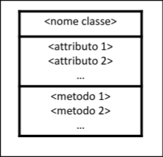
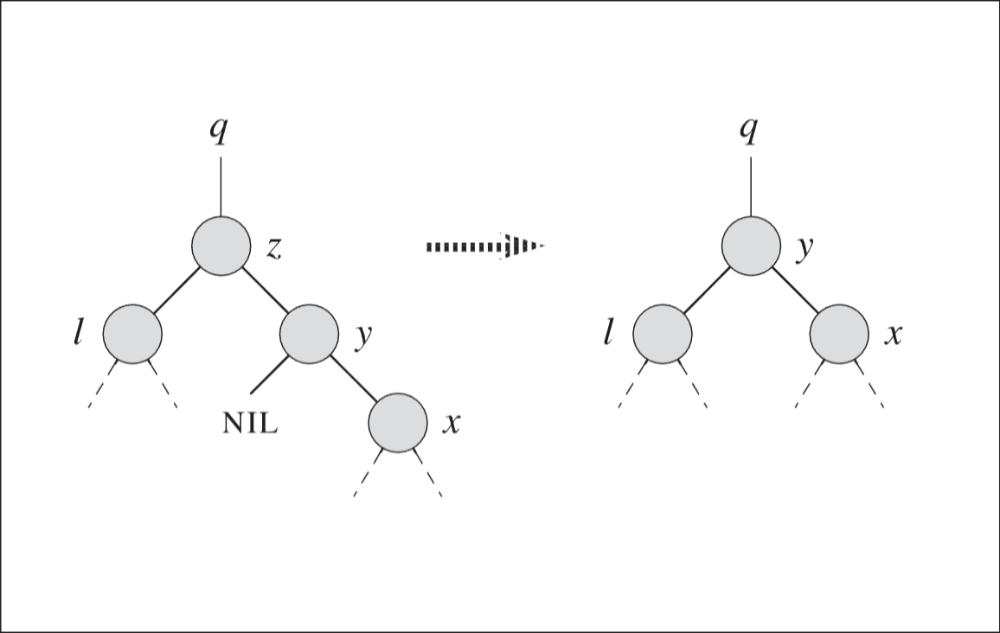
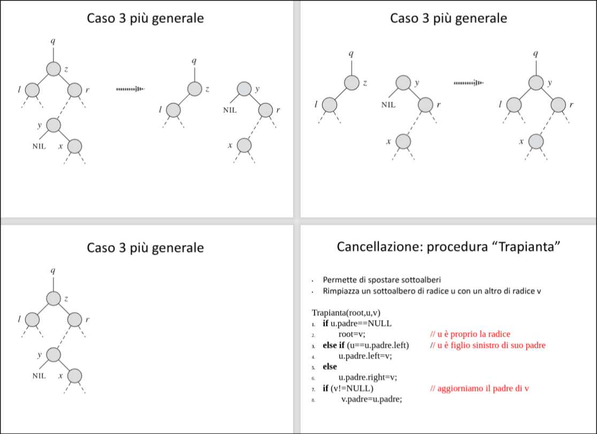

# Programmazione ad oggetti
### Alcune Definizioni
L’**astrazione** è un procedimento che consente di semplificare la realtà che vogliamo modellare. La semplificazione avviene concentrando l’attenzione solo sugli elementi importanti del sistema complesso che stiamo considerando.

Un **algoritmo** è un insieme di istruzioni che a partire da  dati di input permettono di ottenere i risultati di output.Un algoritmo deve essere riproducibile, deve avere una durata finita e non deve essere ambiguo. Il modo di programmare pone attenzione sulla sequenza di esecuzione.

Un **sistema** è una parte del mondo che si sceglie di considerare come un intero, composto da componenti. Ogni componente è caratterizzata da proprietà rilevanti, e da azioni che creano interazioni tra le proprietà e le altre componenti.

## Classi e Oggetti
La **Classe** (Il **Modello**) è il concetto astratto, lo "stampo" o progetto di base. Una classe incapsula (cioè racchiude e struttura logicamente) le caratteristiche e i comportamenti che avranno le entità che vogliamo rappresentare nel nostro programma.

L'**Oggetto** (L'**Istanza**) è l'elemento base e concreto della OOP, creato fisicamente a partire dalla sua Classe. Ogni oggetto è formato da due componenti fondamentali:

- **Attributi** (Stato): Sono le caratteristiche o proprietà che descrivono l'oggetto.

- **Metodi** (Comportamenti): Sono le funzionalità e le operazioni che l'oggetto è in grado di compiere o che mette a disposizione degli altri.

Il **Sistema** e l'**Interazione**<br>
Un programma a oggetti è essenzialmente un modello di sistema popolato da molteplici oggetti. Questi non sono entità isolate, ma comunicano e interagiscono continuamente tra loro attraverso lo scambio di messaggi (che, in termini pratici, corrisponde all'invocazione dei rispettivi metodi).

### Incapsulamento
Per **incapsulamento** si indica la proprietà degli oggetti di incorporare al loro interno sia ttributi che metodi, in modo da avere tutte le informazioni riguardanti gli oggetti ben localizzate.
### Interfaccia di un oggetto
Un oggetto può avere sia una sezione **privata** che una sezione **publica**:
- nella sezione publica vengono messi tutti gli attributi e i metodi che si vuole rendere visibili all'esterno
- nella sezione privata vengono messi tutti gli attributi e metodi che non sono accessibili e che vengono usati internamente dall'oggetto per implementare i suoi comportamenti.
### Classe
Per rappresentare graficamnete le classi si usano i diagrammi delle classi:

</img>

### Ereditarietà
se si dispone di una classe simile a quella che si vuole costruire si puà espandere la classe già esistente per riadattarla. L'ereditarietà è lo strumento che permette di costruire nuove classi utilizzando quelle già sviluppate.
Quando una classe viene creata in questo modo,eredita tutti gli attributi ed i metodi della classe  generatrice. La classe che è stata derivata prende il  nome di **sottoclasse**, mentre la classe generatrice si chiama **sopraclasse**.
La nuova classe si può differenziare per:
- **estensione**: aggiungendo nuovi attributi e metodi.
- **ridefinizione**: modificando i metodi ereditati, specificando un'implementazione diversa di un metodo(**override**, **overload**).
Una classe può avere ereditarietà singola(se ha una sola sopraclasse) o ereditarietà multipla(se ha più sopraclassi).
### Relazioni tra classi
**Association**(relazione d'uso)<br>
Diciamo che una classe A utilizza una classe B se un  oggetto di classe A è in grado di inviare dei messaggi ad un oggetto di classe B oppure se un oggetto di classe  A  può creare, ricevere o restituire oggetti di classe B.<br>
**Aggregation**(relazione di contenimento)<br>
Un oggetto di classe A contiene un oggetto di classe B se B è una proprietà (attributo) di A.<br>
**Composizione**<br>
La composizione è una forma di aggregazione ancora più forte che indica che una "parte" può appartenere ad un solo "intero" in un certo istante di tempo.
### Polimorfismo 
Il **polimorfiasmo** indica la possibilità per i metodi di assumere implementazioni diverse all'interno della gerarchia delle classi
### Collegamento dinamico
Il **collegamento dinamico** è lo strumento utilizzato per la realizzazione del polimorfismo. È dinamico perché l’associazione tra l’oggetto e il metodo corretto da eseguire è effettuata a run-time, cioè durante l’esecuzione del programma.

# Cenni di complessità e tecniche ricorsive
### Complessità di un Problema Computazionale
La complessità computazionale è il ramo dell'informatica teorica che classifica i problemi computazionali in base all'uso delle risorse necessarie per risolverli. Le due risorse principali analizzate sono:
- **Tempo**: Il numero di operazioni base eseguite da un algoritmo.
- **Spazio**: La quantità di memoria necessaria durante l'esecuzione dell'algoritmo.

È fondamentale distinguere tra:
- **Complessità di un algoritmo**: Valuta l'efficienza di una specifica sequenza di istruzioni.
- **Complessità di un problema**: Corrisponde alla complessità del miglior algoritmo possibile in grado di risolvere quel problema. Se il miglior algoritmo noto ha una certa complessità, essa definisce il limite superiore del problema, ma il limite inferiore teorico potrebbe essere diverso fino a quando non viene dimostrato il contrario.

L'analisi della complessità viene effettuata rispetto alla dimensione dell'input, comunemente denotata con la variabile $n$.

### Notazioni Asintotiche e Limite Superiore
L'analisi asintotica descrive il comportamento di una funzione al limite, ovvero come cresce il consumo di risorse al tendere di $n$ verso l'infinito. Questo approccio permette di ignorare costanti moltiplicative e termini di grado inferiore, concentrandosi sul tasso di crescita dominante.

#### Limite Superiore: La Notazione $O$-grande (Big-O)
La notazione $O$ definisce un limite superiore asintotico. Indica il caso peggiore, ovvero garantisce che l'algoritmo non impiegherà mai più tempo di quanto indicato dalla funzione delimitante, a meno di un fattore costante.<br>
Definizione Formale:<br>
Date due funzioni $f(n)$ e $g(n)$, si dice che $f(n) \in O(g(n))$ (spesso scritto impropriamente come $f(n) = O(g(n))$) se esistono due costanti positive $c$ e $n_0$ tali che:
$$0 \le f(n) \le c \cdot g(n) \quad \text{per ogni } n \ge n_0$$
Questo significa che, superata una certa dimensione dell'input ($n_0$), il tempo di esecuzione $f(n)$ è sempre limitato superiormente da un multiplo scalare della funzione $g(n)$.

### Calcolo del Limite Superiore del Tempo di Esecuzione
Per calcolare il limite superiore del tempo di esecuzione di un blocco di codice, si applicano regole sistematiche basate sulla struttura dell'algoritmo:
1. Operazioni di base: Assegnamenti, operazioni aritmetiche, valutazioni booleane e accessi ad array costano $O(1)$ (tempo costante).
2. Sequenza di istruzioni: Se si hanno istruzioni in sequenza con complessità $O(f(n))$ e $O(g(n))$, la complessità totale è la somma, che asintoticamente equivale al massimo tra le due: $\max(O(f(n)), O(g(n)))$.
3. Costrutti condizionali (if-else): Il tempo di esecuzione è il tempo della valutazione della condizione più il massimo tra i tempi di esecuzione dei blocchi if e else.
4. Cicli (for/while): Il tempo di esecuzione è pari alla somma del tempo di esecuzione del corpo del ciclo per ogni iterazione. Se il corpo costa $O(c)$ e il ciclo viene eseguito $n$ volte, la complessità è $O(n \cdot c)$.
5. Cicli annidati: Si procede dall'interno verso l'esterno, moltiplicando il numero di esecuzioni dei cicli.
<br>
**Regola di semplificazione generale:** 
<br>
Date le regole dell'analisi asintotica, le costanti moltiplicative e i termini di grado inferiore vengono omessi. Esempio: <br>$f(n) = 3n^2 + 5n + 10$ diventa direttamente $O(n^2)$.

### Esempi 
1. Tempo Costante $O(1)$:<br>
Il tempo di esecuzione è indipendente dalla dimensione dell'input.

    ```C++
    #include <vector>

        // Calcolo:
        // Controllo condizione (if) -> O(1)
        // Accesso indice 0 -> O(1)
        // Ritorno valore -> O(1)
        // Totale: O(1) + O(1) + O(1) = O(1)
        int getFirstElement(const std::vector<int>& arr) {
            if (arr.empty()) {
                return -1; 
            }
            return arr[0];
        }
    ```

2. Tempo Lineare $O(n)$
Il tempo di esecuzione cresce in modo direttamente proporzionale alla dimensione dell'input $n$.

    ```C++
    #include <vector>

    // Calcolo:
    // Inizializzazione sum = 0 -> O(1)
    // Ciclo for eseguito n volte (dove n = arr.size())
    // Corpo del ciclo (sum += arr[i]) -> O(1) per iterazione
    // Totale: O(1) + n * O(1) = O(n)
    int sumElements(const std::vector<int>& arr) {
        int sum = 0;
        for (size_t i = 0; i < arr.size(); ++i) {
            sum += arr[i];
        }
        return sum;
    }
    ```

3. Tempo Quadratico $O(n^2)$
Tipico di algoritmi con due cicli annidati che iterano entrambi sulla collezione completa.

    ```C++
    #include <vector>

    // Calcolo:
    // Inizializzazione count = 0, n = arr.size() -> O(1)
    // Ciclo esterno eseguito n volte.
    // Ciclo interno eseguito n volte per ogni iterazione del ciclo esterno.
    // Corpo interno (count++) -> O(1)
    // Totale: O(1) + n * (n * O(1)) = O(n^2)
    int countPairs(const std::vector<int>& arr) {
        int count = 0;
        size_t n = arr.size();
        
        for (size_t i = 0; i < n; ++i) {
            for (size_t j = 0; j < n; ++j) {
                // Operazione costante
                count++;
            }
        }
        return count;
    }
    ```

4. Tempo Logaritmico $O(\log n)$
Il tempo di esecuzione cresce proporzionalmente al logaritmo della dimensione dell'input. Si verifica tipicamente quando l'input viene dimezzato a ogni iterazione.

    ```C++
    // Calcolo:
    // Inizializzazione count = 0 -> O(1)
    // Il ciclo while continua finché n > 1.
    // A ogni passo, n viene diviso per 2.
    // Il numero di volte che si può dividere n per 2 prima di raggiungere 1 è log_2(n).
    // Corpo del ciclo -> O(1)
    // Totale: O(1) + O(log n) * O(1) = O(log n)
    int countDivisions(int n) {
        int count = 0;
        while (n > 1) {
            n = n / 2;
            count++;
        }
        return count;
    }
    ```
## Ricorsione ed algoritmi di ordinamento basati sulla ricorsione
[In questo file](Sortings.md)


# Strutture Dati
## Alberi
### Introduzione
In informatica, un albero è una struttura dati astratta che modella una gerarchia. Dal punto di vista della teoria dei grafi, un albero è definito come un "grafo diretto" (un insieme di nodi collegati mediante archi direzionati) che rispetta precise restrizioni topologiche:

- **Vincolo di ingresso**: Ogni nodo può avere un solo arco entrante, ma un qualunque numero di archi uscenti.

- **Assenza di cicli**: Non ci sono percorsi chiusi.

- **Radice** (Root): Esiste uno ed un solo nodo che non possiede alcun arco entrante. Poiché in un albero non ci sono nodi con due o più archi entranti, per ogni albero vi deve essere una ed una sola radice.

- **Foglia** (Leaf): Un nodo che non presenta alcun arco uscente è definito foglia (rappresenta la fine di un ramo).
<image src="image-1.png" width="300">

Gli alberi rappresentano una generalizzazione delle **liste concatenate**: mentre in una lista ogni elemento ha un solo successore, in un albero ogni elemento può avere più di un successore. Questa caratteristica li rende ideali per rappresentare partizioni ricorsive di insiemi e strutture organizzative gerarchiche (es. l'organigramma di un'azienda).

##### Terminologia:
- **Padre e Figlio**: Il nodo da cui parte un arco direzionato si dice padre; il nodo a cui questo arco arriva si dice figlio.

- **Fratelli**: Due o più nodi che condividono lo stesso nodo padre sono detti fratelli.

- **Sottoalbero**: Da ogni nodo non-foglia di un albero si dirama una struttura che a sua volta rispetta la definizione di albero, detta sottoalbero. Questo evidenzia la natura intrinsecamente ricorsiva di questa struttura dati.


### Proprietà Ricorsive, Cammini e Livelli
#### Ricorsività
Un albero può essere definito rigorosamente in termini ricorsivi come un insieme di nodi che:

- È vuoto (non contiene nodi).

- Oppure ha un nodo designato denominato radice, da cui discendono zero o più sottoalberi, che sono essi stessi alberi.

Dato un nodo qualsiasi:

- I **discendenti** sono tutti i nodi che appartengono al suo sottoalbero.

- Gli **ascendenti** sono tutti i nodi che si trovano nel cammino (percorso) che va dalla radice fino al nodo in questione.

#### Livelli e Profondità
La posizione dei nodi all'interno dell'albero è misurata in livelli e profondità:

- Livello di un nodo: È la distanza (numero di archi) del nodo dalla radice. La radice si trova sempre a livello 0, i suoi figli diretti a livello 1, i nipoti a livello 2, e così via.

- I nodi fratelli si trovano sempre allo stesso livello (ma non è vero il contrario: nodi allo stesso livello non sono necessariamente fratelli).

- Profondità (o altezza) di un albero: Corrisponde alla lunghezza del cammino più lungo che parte dalla radice e termina in una foglia.

<image src="image-2.png" width="500">

L'algoritmo per calcolare la profondità di un nodo specifico (definita come il numero di passi per risalire fino alla radice) è il seguente:

```C++
p = 0;
while (nodo.padre != null) {
    p = p + 1;
    nodo = nodo.padre;
}
return p;
```

#### Alberi Equilibrati (Bilanciati)
Un albero di profondità h si definisce equilibrato (o bilanciato) se rispetta criteri rigorosi di riempimento:

- Tutte le foglie si trovano esattamente allo stesso livello.

- Dato un numero massimo k di figli consentiti per nodo, ogni nodo interno (inclusa la radice) possiede esattamente k figli.

<image src="image-3.png" width="200">

### Alberi Bianri
Un caso di studio fondamentale è l'Albero Binario. Un albero è detto binario se ogni nodo possiede al massimo due figli, convenzionalmente distinti in figlio sinistro e figlio destro (che generano rispettivamente il sottoalbero sinistro e il sottoalbero destro).

All'estremo opposto di un albero equilibrato troviamo l'albero degenere, in cui ogni nodo ha al massimo un solo figlio. In questo caso, l'albero perde i suoi vantaggi gerarchici e collassa in una struttura lineare simile a una lista concatenata.

**Proprietà matematiche degli alberi binari:**
Ad ogni livello $n$, un albero binario può contenere al massimo $2^n$ nodi.Il numero totale massimo di nodi in un albero binario completo di profondità $n$ (incluse le foglie) è pari a $2^{n+1} - 1$.

### Alberi Binari di Ricerca (BST)

L'Albero Binario di Ricerca (**Binary Search Tree**) introduce un vincolo sui valori memorizzati nei nodi, che permette di ottimizzare le operazioni di ricerca.<br>
**Proprietà fondamentale del BST:**<br>
Dato un nodo generico $x$:
- Se $y$ è un nodo situato nel sottoalbero sinistro di $x$, allora il valore di $y$ deve essere minore del valore di $x$ ($y.valore < x.valore$).
- Se $y$ è un nodo situato nel sottoalbero destro di $x$, allora il valore di $y$ deve essere maggiore o uguale al valore di $x$ ($y.valore \ge x.valore$).

<image src="image-4.png" width="200">

### Visita di un Albero Binario (Traversal)

Per elaborare tutti i dati contenuti nell'albero, esistono tre strategie algoritmiche notevoli basate sulla ricorsione. La differenza risiede nell'ordine in cui viene processato il nodo radice rispetto ai suoi sottoalberi:

- Visita **Pre-order** (Anticipata): Si elabora prima la radice, poi il sottoalbero sinistro, e infine il sottoalbero destro.

- Visita **In-order** (Simmetrica): Si processa prima il sottoalbero sinistro, poi la radice, e infine il sottoalbero destro. Nota fondamentale: applicando una visita in-order su un BST, i valori verranno stampati in ordine crescente ordinato.

- Visita **Post-order** (Posticipata): Si processa prima il sottoalbero sinistro, poi quello destro, e infine si elabora la radice.

<image src="image-5.png" width="500">

Implementazione:
```C++
void preOrder(Nodo* p) {
    if (p) {
        cout << p->valore << ' ';    // Visita la radice
        preOrder(p->sinistro);       // Visita il sottoalbero sx
        preOrder(p->destro);         // Visita il sottoalbero dx
    }
}

void inOrder(Nodo* p) {
    if (p) {
        inOrder(p->sinistro);        // Visita il sottoalbero sx
        cout << p->valore << ' ';    // Visita la radice
        inOrder(p->destro);          // Visita il sottoalbero dx
    }
}

void postOrder(Nodo* p) {
    if (p) {
        postOrder(p->sinistro);      // Visita il sottoalbero sx
        postOrder(p->destro);        // Visita il sottoalbero dx
        cout << p->valore << ' ';    // Visita la radice
    }
}
```

**Costo della visita**: La complessità computazionale per attraversare un albero di $n$ nodi è $T(n) = \Theta(n)$. Devono essere effettuati almeno $n$ passi (visitare ogni nodo), e poiché ogni operazione all'interno del nodo ha costo costante, il costo totale cresce linearmente al numero di nodi.

### Operazioni sui BST
#### Inserimento
I nuovi elementi in un BST vengono sempre inseriti come nuove foglie. L'algoritmo discende l'albero partendo dalla radice e scegliendo il ramo sinistro o destro confrontando il valore da inserire con il nodo corrente, fino a trovare un puntatore nullo dove agganciare il nuovo nodo.
```C++
Insert(T, elemento) {
    x = T.root;
    y = NULL;
    
    // Discesa dell'albero per trovare la posizione foglia
    while (x != NULL) {
        y = x;                  // 'y' serve a mantenere il puntatore al padre di 'x'
        if (elemento < x.val)
            x = x.left;
        else 
            x = x.right;
    }
    
    // Creazione e collegamento del nuovo nodo
    new_nodo; 
    new_nodo.padre = y;
    new_nodo.val = elemento;
    
    if (y == NULL)              // Caso: l'albero era vuoto
        T.root = new_nodo;
    else if (new_nodo.val < y.val)
        y.left = new_nodo;
    else 
        y.right = new_nodo;
}
```

#### Ricerca
La ricerca di una chiave sfrutta la proprietà del BST, scartando metà dell'albero ad ogni passo (nel caso medio). La complessità temporale è proporzionale all'altezza dell'albero: $O(h)$. Se l'albero è degenere, la ricerca diventa $O(n)$.<br>
Versione Ricorsiva:
```C++
Ricerca(T, elemento) {
    // T è tipicamente un puntatore alla radice
    if (T == NULL or elemento == T.val) return T;
    
    if (elemento < T.val) 
        return Ricerca(T.left, elemento);
    else 
        return Ricerca(T.right, elemento);
}
```


Versione Iterativa (più efficiente in termini di memoria):
```C++
Ricerca_Iterativa(T, elemento) {
    x = T;
    while (x != NULL and elemento != x.val) {
        if (elemento < x.val) 
            x = x.left;
        else 
            x = x.right;
    }
    return x;
}
```

#### Ricerca del Minimo e del Massimo
In un BST, il valore minimo si trova scendendo sempre verso i figli sinistri, finché non si incontra NULL. Similmente, il valore massimo si trova scendendo sempre verso destra. Anche in questo caso la complessità è $O(h)$.

```C++
Minimo(T) {
    x = T;
    while (x.left != NULL) 
        x = x.left;
    return x;
}

Massimo(T) {
    x = T;
    while (x.right != NULL) 
        x = x.right;
    return x;
}
```

#### Ricerca del Successore
Il successore di un nodo $x$ è il nodo con il valore immediatamente superiore a $x$ presente nell'albero. Si presentano due casi:
- Il sottoalbero destro di $x$ NON è vuoto (Caso banale): Il successore è semplicemente il valore minimo del sottoalbero destro.
- Il sottoalbero destro di $x$ è vuoto: Si deve risalire verso l'alto (verso i padri). Il successore è il primo antenato di $x$ il cui figlio sinistro è anch'esso un antenato di $x$ (ovvero, la prima volta che risalendo si "svolta" a destra, salendo da un figlio sinistro al proprio padre).

```C++
Successore(x) {
    if (x.right != NULL)
        return x.right; // Caso banale
        
    y = x.padre; // Risaliamo l'albero
    while (y != NULL && x == y.right) {
        x = y;
        y = y.padre;
    }
    return y;
}
```

#### Cancellazione di un nodo (Delezione)
L'operazione di cancellazione è la più complessa, poiché deve preservare la struttura e le proprietà del BST. Si presentano tre casistiche principali per il nodo $z$ da cancellare:
- $z$ non ha figli (foglia): Il caso più semplice. Si modifica semplicemente il puntatore del padre di $z$ impostandolo a NULL e si elimina il nodo.
- $z$ ha un solo figlio: Si bypassa il nodo $z$. Il figlio di $z$ prende direttamente il posto di $z$ nell'albero, agganciandosi al padre di $z$.
!(Rappresentazione del Caso 2 di cancellazione in cui il nodo z con un solo figlio viene bypassato)
- $z$ ha due figli: In questo caso si deve trovare il successore $y$ di $z$ (che si troverà sicuramente nel sottoalbero destro di $z$ e non avrà figli sinistri). Il nodo $y$ andrà a prendere la posizione fisica di $z$ nell'albero.
    - Caso 3a: Se $y$ è figlio diretto di $z$, basta far salire $y$ al posto di $z$.
    
    - Caso 3 generale: Se $y$ non è figlio diretto, occorre prima sostituire $y$ con il proprio figlio destro, per poi sostituire $z$ con $y$.
    
    Per gestire comodamente questi scambi di sottoalberi, si definisce una funzione ausiliaria Trapianta che rimpiazza un sottoalbero radicato in $u$ con un sottoalbero radicato in $v$:

```C++
Trapianta(root, u, v) {
if (u.padre == NULL)
    root = v;                   // u è la radice dell'albero
else if (u == u.padre.left)
    u.padre.left = v;           // u è figlio sinistro
else
    u.padre.right = v;          // u è figlio destro
        
if (v != NULL)
    v.padre = u.padre;          // Aggiorniamo il padre di v
}
```
```C++
Delete(root, z) {
    if (z.left == NULL)
        Trapianta(T, z, z.right);       // Manca figlio sx: sposto il dx al posto di z (Caso 1 e 2)
    else if (z.right == NULL)
        Trapianta(T, z, z.left);        // Manca figlio dx: sposto il sx al posto di z (Caso 2)
    else {                              // Caso 3: z ha entrambi i figli
        y = Minimo(z.right);            // y è il successore
        
        if (y.padre != z) {             // Caso 3 generale: y non è figlio diretto di z
            Trapianta(T, y, y.right);   // Sostituisco y con il suo figlio destro
            y.right = z.right;          // Ricostruisco i collegamenti destri
            y.right.padre = y;
        }
        
        Trapianta(T, z, y);             // y prende il posto di z
        y.left = z.left;                // Ricostruisco i collegamenti sinistri
        y.left.padre = y;
    }
}
```

## Grafi
### Definizioni fondamentali
Un grafo è definito matematicamente come una coppia $G = (V, E)$, dove:
- V: è l'insieme dei nodi (o vertici).
- E: è l'insieme degli archi che legano "a due a due" i nodi $(u, v)$ di V.

I grafi si dividono in due macro-categorie principali:

1. **Grafi Direzionati**<br>
    In un grafo direzionato, l'insieme $E$ è costituito da coppie ordinate di nodi $(u, v)$.
    - Se l'arco $(u, v)$ appartiene ad $E$, si dice che l'arco è uscente dal nodo $u$ ed entrante nel nodo $v$.
    - Se l'arco $(u, v)$ è in $E$, il nodo $v$ si definisce adiacente a $u$.

    <image src="image-8.png" width="350">

2. **Grafi Non Direzionati**<br>
    In un grafo non direzionato, l'insieme $E$ consiste in coppie non ordinate di nodi.

    - In un arco $(u, v)$, i nodi $u$ e $v$ sono considerati sia entranti che uscenti l'uno rispetto all'altro.
    - L'adiacenza è simmetrica: se $u$ è adiacente a $v$, allora $v$ è adiacente a $u$.
    - Nei grafi non direzionati standard non sono ammessi i self-loops (archi che partono e arrivano sullo stesso nodo).

    <image src="image-9.png" width="350">


#### Grado di un Nodo, Cammini e Cicli
- **Grado di un nodo** (grafo non direzionato): È il numero di archi incidenti sul nodo.
- **Grado di un nodo** (grafo direzionato): È la somma del numero di archi entranti e del numero di archi uscenti.
- **Cammino**: Un cammino di lunghezza $k$ da un nodo $u$ a un nodo $v$ è una sequenza di nodi $\langle v_0, v_1, ..., v_k \rangle$ tale che $u = v_0$, $v = v_k$ e per ogni $i$, l'arco $(v_{i-1}, v_i)$ appartiene ad $E$.
    - Si dice che il cammino contiene i vertici $v_0, ..., v_k$ e gli archi $(v_0, v_1), ..., (v_{k-1}, v_k)$.- **Sottocammino**: Una sottosequenza contigua di vertici di un cammino (es: $v_i, ..., v_j$ con $0 \le i \le j \le k$).
    - Un nodo $v$ è raggiungibile da $u$ se esiste un cammino da $u$ a $v$.
    - Un cammino si definisce semplice se tutti i vertici in esso contenuti sono distinti.
- Ciclo: È un cammino $\langle v_0, ..., v_k \rangle$ in cui il nodo di partenza coincide con quello di arrivo ($v_0 = v_k$).
    - Il ciclo è semplice se tutti i suoi nodi (tranne il primo e l'ultimo) sono distinti.
    - Un grafo privo di cicli è detto aciclico.

### Connettività e Sottografi
#### Connettività

- **Grafo (non direzionato) connesso**: Ogni coppia di vertici è unita da un cammino. Un grafo non direzionato è connesso se ha esattamente 1 componente connessa.

- **Componenti connesse (non direzionato)**: Sono le classi di equivalenza determinate dalla relazione "è raggiungibile da". Rappresentano i sottografi massimali connessi.


- **Grafo (direzionato) fortemente connesso**: Per ogni coppia di vertici $(u, v)$ esiste sia un cammino che unisce $u$ a $v$, sia un cammino che unisce $v$ a $u$.
- **Componenti fortemente connesse** (direzionato): Sono le classi di equivalenza determinate dalla relazione "sono mutualmente raggiungibili".


#### Sottografi e Grafi Completi
- **Sottografo**: Un grafo $G'=(V', E')$ è un sottografo di $G=(V, E)$ se l'insieme dei nodi $V'$ è un sottoinsieme di $V$ e l'insieme degli archi $E'$ è un sottoinsieme di $E$.
- **Grafo completo**: Un grafo (non direzionato) si dice completo se ogni coppia di vertici è collegata da un arco (ogni nodo è adiacente a tutti gli altri).


### Rappresentazione di un Grafo
Esistono due modi fondamentali per rappresentare un grafo in memoria. La scelta dipende principalmente dalla densità degli archi.

1. Liste di Adiacenza<br>
    Utili soprattutto per rappresentare grafi sparsi (dove il numero di archi $|E|$ è molto minore di $|V|^2$). Richiede uno spazio in memoria di $O(|V| + |E|)$.
    - È costituita da un array di dimensione $|V|$ contenente una lista per ogni vertice.
    - La lista $Adj[u]$ contiene i puntatori a tutti i vertici $v$ per i quali esiste un arco $(u, v)$ in $E$.
    - Nei grafi direzionati, la somma delle lunghezze di tutte le liste è esattamente $|E|$.
    - Nei grafi non direzionati, poiché ogni arco collega due nodi, l'arco viene inserito in entrambe le liste. Pertanto, la somma delle lunghezze di tutte le liste è $2|E|$.

    <image src="image-10.png" width="450">
    <image src="image-11.png" width="450">

2. Matrici di Adiacenza
    Utile per grafi densi o quando è necessario verificare l'esistenza di un arco specifico in tempo costante $O(1)$. Richiede uno spazio in memoria proporzionale a $O(|V|^2)$.
    - È una matrice quadrata $A$ di dimensione $|V| \times |V|$.
    - Il valore dell'elemento $a_{ij}$ è $1$ se esiste l'arco $(i, j)$ nell'insieme $E$, altrimenti è $0$.
    
    <image src="image-12.png" width="450">


### Ricerca in Ampiezza (Breadth-First Search - BFS)

L'algoritmo di visita BFS esplora il grafo in "ampiezza" a partire da un nodo sorgente $s$. Scopre tutti i vertici raggiungibili da $s$ esplorando prima i nodi a distanza 1, poi quelli a distanza 2, e così via.
- Calcola la distanza minima (numero di archi) di ogni nodo raggiungibile da $s$.
- Produce implicitamente un Breadth-First Tree (BFT), ovvero un albero dei cammini minimi.

#### I Colori

L'algoritmo utilizza tre colori per tracciare lo stato dei nodi:

- **Bianco**: Nodo non ancora scoperto (stato iniziale per tutti i nodi).

- **Grigio**: Nodo scoperto (visitato per la prima volta). Rappresenta la frontiera tra l'esplorato e il non esplorato. I nodi grigi vengono inseriti in una coda FIFO.

- **Nero**: Nodo di cui è stata esplorata completamente l'intera lista di adiacenza (tutti i suoi vicini sono stati scoperti).

#### Breadth-first Trees (Alberi dei predecessori)

La procedura costruisce un grafo dei predecessori $G_p = (V_p, E_p)$ dove:
- $V_p = \{v \in V : pred[v] \neq \text{NULL}\} \cup \{s\}$
- $E_p = \{(pred[v], v) \in E : v \in V_p, v \neq s\}$

$G_p$ è un albero in cui esiste un unico cammino da $s$ a $v$, e tale cammino è il più breve possibile. Gli archi in $E_p$ sono chiamati tree-edges.


### Ricerca in Profondità (Depth-First Search - DFS)

L'algoritmo DFS esplora il grafo "in profondità". Esplora gli archi a partire dal nodo appena scoperto $v$ finché ci sono archi uscenti non esplorati. Quando termina gli archi di $v$, esegue un backtracking (torna indietro) al nodo dal quale $v$ era stato scoperto. Il processo si ripete finché tutti i nodi sono esplorati.


A differenza della BFS che crea un singolo albero a partire da una sorgente, la DFS crea una Depth First Forest (foresta di alberi), poiché se rimangono nodi non visitati alla fine di un'esplorazione, l'algoritmo riparte da uno di essi.

#### Timestamps (Etichette Temporali)
La DFS marca temporalmente ogni vertice con due etichette:
- $d[v]$: registra il momento in cui il nodo viene scoperto (passaggio da bianco a grigio).
- $f[v]$: registra il momento in cui la ricerca finisce di esaminare la lista di adiacenza del nodo (passaggio da grigio a nero).
- Per ogni nodo $v$, vale sempre la relazione: $d[v] < f[v]$.


#### Classificazione degli Archi
L'esecuzione di una DFS permette di classificare tutti gli archi del grafo originario in quattro tipologie:

1. Tree edges (Archi dell'albero): Sono gli archi presenti nella foresta $G_p$. L'arco $(u, v)$ è un tree edge se il nodo $v$ viene scoperto per la prima volta attraversando l'arco $(u, v)$.
2. Back edges (Archi all'indietro): L'arco $(u, v)$ collega un nodo $u$ a un suo antenato $v$ all'interno di un depth-first tree.
3. Forward edges (Archi in avanti): L'arco $(u, v)$ collega il nodo $u$ a un suo discendente $v$ all'interno del depth-first tree (non sono tree edges diretti).
4. Cross edges (Archi di attraversamento): Tutti gli altri tipi di archi. Possono collegare vertici nello stesso albero (senza relazione antenato/discendente) o vertici di alberi differenti nella foresta.