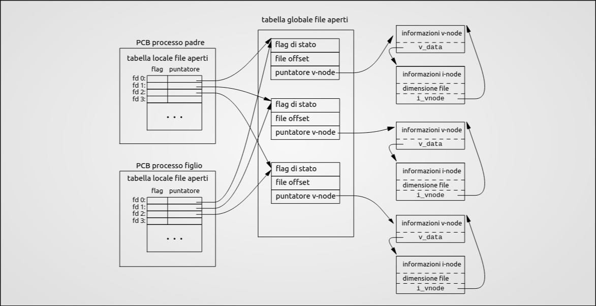

# Laboratorio
Nei moderni sistemi operativi possiamo fare due tipi di chiamate:<br>
- **chiamate di sistema**: offerte dal sistema operativo(**modalità kernel**)<br>
- **chiamate di libreria**: funzioni incluse in librerie di sistema(**modalità utente**) 

> [Libreria del professore](./Esempi/at_exit.c)

## Layout della memoria
 Quando un programma viene avviato, il sistema operativo gli assegna uno spazio di memoria suddiviso in segmenti specifici. Comprendere questa divisione è fondamentale per capire dove "vivono" le tue variabili.

Puoi vedere la dimensione di questi segmenti su un file compilato usando il comando da terminale `size nome_eseguibile`.
I Segmenti di Memoria:

- Text (Codice): Contiene le istruzioni del programma compilato in linguaggio macchina.

-  Data (Dati Inizializzati): Contiene le variabili globali (o statiche) a cui hai assegnato un valore nel codice (es. `int max = 100;`).

- BSS (Dati Non Inizializzati): Contiene le variabili globali (o statiche) dichiarate ma senza un valore iniziale (es. `int vector[50];`). Il sistema operativo le inizializza automaticamente a zero quando avvia il programma.

- Heap: Memoria dinamica, gestita manualmente dal programmatore (dove allochi spazio con `malloc` e lo liberi con `free`).

- Stack: Memoria automatica gestita dal sistema. Contiene le variabili locali dichiarate dentro le funzioni e gli argomenti passati alle funzioni stesse.

## Gestione degli errori

In C (su sistemi UNIX), le chiamate di sistema (system call) non "crashano" mostrando finestre di errore, ma segnalano il problema tramite i valori di ritorno.

- Quasi tutte le system call restituiscono -1 se c'è stato un errore.

- La variabile errno: Se una funzione restituisce -1, il sistema imposta automaticamente una variabile globale chiamata errno con un codice numerico che identifica il tipo di errore (es. EPERM per permesso negato, ENOENT se il file non esiste).

- Attenzione: In caso di successo, errno non viene resettata a zero. Devi controllarla solo dopo aver verificato che la funzione ha restituito -1.

### Funzioni per stampare l'errore:
<table border="1" style="border-collapse: collapse; text-align: left;">
  <thead>
    <tr>
      <th>Funzione</th>
      <th>Libreria</th>
      <th>Descrizione</th>
    </tr>
  </thead>
  <tbody>
    <tr>
      <td><code>perror(const char *s)</code></td>
      <td><code>&lt;stdio.h&gt;</code></td>
      <td>È la più comoda e usata. Stampa a schermo la tua <br>stringa <code>s</code>, seguita dai due punti e dalla descrizione <br> umana dell'errore (es. <code>perror("Errore apertura");</code><br> stampa <em>Errore apertura: No such file or directory</em>).</td>
    </tr>
    <tr>
      <td><code>strerror(int errnum)</code></td>
      <td><code>&lt;string.h&gt;</code></td>
      <td>Prende il numero dell'errore e restituisce solo la stringa <br>descrittiva (utile se vuoi formattare l'output manualmente <br>con una <code>printf</code>).</td>
    </tr>
  </tbody>
</table>

## Terminazione del processo

Un processo può terminare in vari modi (es. arrivando alla fine del main). Tuttavia, per forzare la chiusura o indicare al sistema operativo l'esito dell'esecuzione, si usa la funzione exit.

- Funzione: `void exit(int status)`; (Richiede `<stdlib.h>`)

- Exit Code (Codice di stato): È il numero che il tuo programma restituisce al sistema operativo alla chiusura.

    - `0` (o la costante `EXIT_SUCCESS`): Tutto è andato bene.

    - `>0` (o la costante `EXIT_FAILURE`): Il programma è terminato a causa di un errore.

-  Terminazione "Pulita": Quando chiami `exit()`, il sistema non "uccide" brutalmente il programma, ma prima scrive i buffer di memoria rimasti in sospeso e avvia eventuali procedure di chiusura che hai registrato tramite la funzione `atexit()`.<br>
[Esempio](./Esempi/at_exit.c)

## Descrittori dei File
In UNIX/Linux, tutto è considerato un file (hardware, terminali, file di testo, connessioni di rete). Per gestire questi "file", il sistema operativo usa i File Descriptors.

- Cos'è: È semplicemente un numero intero non negativo (0, 1, 2, 3...) che il sistema operativo ti "presta" come riferimento quando apri un file. Userai questo numero per tutte le operazioni successive (lettura, scrittura, chiusura).

- Canali Predefiniti: Appena avvii un programma, hai già 3 FD aperti di default (definiti in `<unistd.h>`):

<table border="1" style="border-collapse: collapse; text-align: left; width: 100%;">
  <thead>
    <tr>
      <th style="padding: 8px; text-align: center;">FD</th>
      <th style="padding: 8px;">Costante C</th>
      <th style="padding: 8px;">Significato</th>
      <th style="padding: 8px;">Destinazione tipica</th>
    </tr>
  </thead>
  <tbody>
    <tr>
      <td style="padding: 8px; text-align: center;"><code>0</code></td>
      <td style="padding: 8px;"><code>STDIN_FILENO</code></td>
      <td style="padding: 8px;">Standard Input</td>
      <td style="padding: 8px;">Tastiera</td>
    </tr>
    <tr>
      <td style="padding: 8px; text-align: center;"><code>1</code></td>
      <td style="padding: 8px;"><code>STDOUT_FILENO</code></td>
      <td style="padding: 8px;">Standard Output</td>
      <td style="padding: 8px;">Schermo (Terminale)</td>
    </tr>
    <tr>
      <td style="padding: 8px; text-align: center;"><code>2</code></td>
      <td style="padding: 8px;"><code>STDERR_FILENO</code></td>
      <td style="padding: 8px;">Standard Error</td>
      <td style="padding: 8px;">Schermo (Terminale, per gli errori)</td>
    </tr>
  </tbody>
</table>


## Apertura, creazione e chiusura (`open()`, `creat()` e `exit()`)
```C
#include <fcntl.h>
#include <unistd.h>
```

### La funzione `open()`


```C
int open(const char *path, int oflag, [mode_t mode]);
```

Apre un file con percorso `path` e restituisce il file descriptor, ovvero un intero non negativo che fa da indice in una voce della tabella dei file descriptor del processo chiamante. Una chiamata `open()` genera inoltre una nuova voce nella tabella dei file aperti a livello di sistema(system-wide open file table), all'interno della quale vengono registrati l'offset corrente del file e i flag di stato.
L'argomento `flag` deve contenere almeno una modalità di accesso tra:
- `O_RDONLY`: read only
- `O_WRONLY`: write only
- `O_RDWR`: read/write

In aggiunta possono essere cobminate 0 o più flags per l'apertura. <br>Consultare [man](https://man7.org/linux/man-pages/man2/open.2.html) per la lista completa dei flags.<br><br>
In caso di errore la funzione restituisce `-1` e aggiorna `errno` per indicare l'errore. 

### La funzione `creat()`

``` C
int creat(const char *path, mode_t mode ); 
```

Equivalente a `open()`. Infatti si comporta come se venisse chiamata nel seguente modo:
``` C 
 int creat(const char *path, mode_t mode)
  {
    return open(path, O_WRONLY|O_CREAT|O_TRUNC, mode);
  } 
```

- `O_WRONLY`: il file viene aperto in sola scrittura
- `O_CREAT`: il file viene creato se non esiste
- `O_TRUNC`: se il file esiste già, la sua lunghezza venga troncata a 0 (sovrascritto)

### La funzione `close()`

```C
int close(int fd);
```
Chiude un file descriptor. Restituisce `0` se ha successo e `-1` aggiornando `errno` in caso di errore.

## Permessi sugli oggetti del File-System UNIX
Nei metadati del file(all'interno dell'inode) il sistema riserva un intero per memorizzare varie informazioni. Gli ultimi 9 bit sono dedicati ai permessi. 
Un bit `1` signfica "permesso accordato" e un bit a `0` vuol dire "permesso negato".
Questi 9 bit sono suddivi in 3 blocchi da 3 bit ciascuno(`R`, `W`, `X`; read, write e execute):
- permessi utente proprietario(USR)
- permessi gruppo proprietario(GRP)
- permessi per gli altri utenti(OTH)

Quindi, un file con tutti i permessi avrà gli ultimi 9 bit dell'inode messi a `111 111 111` in binario o 0777 in rappresentazione ottale. 
Il comando per impostare i permessi è `chmod`. Es. `chmod 0777`.

Questa maschera si può ottenere da costanti definite in `sys/stat.h`
<table border="1" style="border-collapse: collapse; text-align: left; width: 100%;">
  <thead>
    <tr>
      <th style="padding: 8px;">Flag</th>
      <th style="padding: 8px;">Ottale</th>
      <th style="padding: 8px;">Permesso</th>
    </tr>
  </thead>
  <tbody>
    <tr>
      <td style="padding: 8px;">S_IRUSR</td>
      <td style="padding: 8px;">00400</td>
      <td style="padding: 8px;">owner has read permission</td>
    </tr>
    <tr>
      <td style="padding: 8px;">S_IWUSR</td>
      <td style="padding: 8px;">00200</td>
      <td style="padding: 8px;">owner has write permission</td>
    </tr>
    <tr>
      <td style="padding: 8px;">S_IXUSR</td>
      <td style="padding: 8px;">00100</td>
      <td style="padding: 8px;">owner has execute permission</td>
    </tr>
    <tr>
      <td style="padding: 8px;"></td>
      <td style="padding: 8px;"></td>
      <td style="padding: 8px;"></td>
    </tr>
    <tr>
      <td style="padding: 8px;">S_IRGRP</td>
      <td style="padding: 8px;">00040</td>
      <td style="padding: 8px;">group has read permission</td>
    </tr>
    <tr>
      <td style="padding: 8px;">S_IWGRP</td>
      <td style="padding: 8px;">00020</td>
      <td style="padding: 8px;">group has write permission</td>
    </tr>
    <tr>
      <td style="padding: 8px;">S_IXGRP</td>
      <td style="padding: 8px;">00010</td>
      <td style="padding: 8px;">group has execute permission</td>
    </tr>
    <tr>
      <td style="padding: 8px;"></td>
      <td style="padding: 8px;"></td>
      <td style="padding: 8px;"></td>
    </tr>
    <tr>
      <td style="padding: 8px;">S_IROTH</td>
      <td style="padding: 8px;">00004</td>
      <td style="padding: 8px;">others have read permission</td>
    </tr>
    <tr>
      <td style="padding: 8px;">S_IWOTH</td>
      <td style="padding: 8px;">00002</td>
      <td style="padding: 8px;">others have write permission</td>
    </tr>
    <tr>
      <td style="padding: 8px;">S_IXOTH</td>
      <td style="padding: 8px;">00001</td>
      <td style="padding: 8px;">others have execute permission</td>
    </tr>    
  </tbody>
</table>

Per le directory `X` rappresenta il diritto di attraversamento.

## Maschera di Creazione per i Permessi
Per ragioni di sicurezza quando un file(o una directory) viene creato la maschera(dei permessi) specificata viene combinata da una maschera di creazione che inibisce globalmente alcuni permessi.
La maschera dei permessi effettiva è data da: <br>
`effettiva = specificata & (~umask)`<br>

dove 

```c
mode_t umask(mode_t cmask);
```

L'espressione inibisce i permessi di `umask` messi a 1 lasciando gli altri intatti.

Se la directory padre in cui si sta creando il file ha una ACL di default(Access Control List), ovvero una maschera dei permessi, la `umask` del processo chiamante viene ignorata, il nuovo file eredita l'ACL del padre e i permessi effettivi vengono calcolati basandosi sull'ACL ereditata, incrociata con la maschera specificata dal chiamante.<br>
[Esempio Prof](./Esempi/creation-mask.c)<br>
[Mio Esempio](./Esempi/my_creation-mask.c)


## Posizionamento 
All'interno della System-Wide Open File Table vi è una voce che contiene la posizione attuale all'interno del file(offset), questo serve a simulare l'accesso sequenziale. Viene posto a `0` se durante la chiamata `open()` non si usa il flag `O_APPEND` e viene aggiornato dopo ogni operazione.

```C
off_t lseek(int fd, off_t offset, int whence);
```
Permette di spostare l'offset di un numero di bytes pari al parametro `offset` rispetto al punto `whence` che può assumere i seguenti valori:
- `SEEK_SET`: L'offset è posizionato a `offset` bytes
- `SEEK_CUR`: L'offset è posizionato alla posizione corrente più `offset` bytes
- `SEEK_END`: L' offset è posizionato alla dimensione del file(fine) più `offset` bytes<br>

Dalla versione del Kernel Linux 3.1 supporta anche le seguenti modalità:
- `SEEK_DATA`
- `SEEK_HOLE`<br>

`lseek()` permette di posizionare l'offset oltre la fine del file(questo però non ne cambierà la dimensione).Tuttavia, se si effettua una successiva operazione di `write()`, lo spazio tra la vecchia fine del file e il nuovo testo verrà riempito di byte nulli (`\0`), creando un  file hole. Questi buchi occupano spazio logico ma non consumano necessariamente blocchi fisici sul disco.

 La funzione`lseek()` ritorna `-1` in caso di errore o la nuova posizione all'intenro del file (`≥0`).
 Per ottenere la posizione attuale basta fare:
 ```C
 pos = lseek(fd, 0, SEEK_CUR);
 ```
 [Esempio Prof](./Esempi/test-seek-on-stdin.c)

 ## Lettura e Scrittura

 ### La funzione `read()`
 ```C
ssize_t read(int fd, void *buf, size_t nbytes);
 ```

Cerca di leggere fina a un numero `nbytes` di bytes, dal File Descriptor `fd`, mettendoli nel buffer  `buf`.

Nei File che supportano seeking la lettura inizia dall'offset indicato nella System-Wide Open File Table, e l'offset verrà spostato del numero di byte letti. Se l'offset è alla fine del file o oltre non verranno letti bytes e `read()` restituisce `0`. In caso di successo la funzione restituisce il numero di bytes letto e in caso di errore resituisce `-1` aggiornando `errno`, in questo caso non è specificato se la posizione all'interno file(se esiste) cambi.

> **Differenza tra size_t e ssize:t**
> * **`size_t`**: Intero **senza segno** (*unsigned*). Usato per i parametri di input (come `nbytes`) dove il valore deve essere sempre positivo.
> * **`ssize_t`**: Intero **con segno** (*signed*). Usato per il valore di ritorno perché deve poter restituire `-1` in caso di errore.


### La funzione `write()`
```C
ssize_t write(int fd, const void *buf, size_t nbytes);
```
Scrive fino a `nbytes` byte nel file descriptor `fd` leggendoli dal buffer `buf`.
Il numero di byte scritti può essere minore di quello indicato in `nbytes`se, per esempio, non c'è spazio sufficiente nel supporto fisico, o se incontra il limite di risorsa `RLIMIT_FSIZE`, o se la chiamata è stata interrotta da un segnale dopo aver scritto meno di `nbytes` byte.

Se il file supporta il seeking, la scrittura inizia dall'offset indicato nella System-Wide Open File Table, e l'offset verrà spostato del numero di byte scritti. Se il file è stato aperto con il flag `O_APPEND` l'offset verrà spostato alla fine del file prima di iniziare a scrivere. Il posizionamento dell'offset del file e l'operazione di scrittura verrano eseguite in modo atomico(inscindibile) dal kernel.


La funzione ritorna il numero di byte scritti. In caso di errore ritorna `-1` e aggiorna `errno`.

[Esempio Lettura Prof](./Esempi/count.c)<br>
[Esempio di scrittura con holes del Prof](./Esempi/hole.c)<br>
[Esempio del Prof con read e write](./Esempi/copy.c)

## Condivisione di Files e strutture dati di supporto


Quando si avvia un nuovo processo, il kernel alloca in memoria un nuovo PCB (Process Control Block), che contiene attributi fondamentali come il `PID` (Process ID), la umask e l'array dei File Descriptor (Per-Process File Descriptor Table).

All'avvio, le prime tre voci di questa tabella locale sono già occupate dai canali standard: `stdin` (0), `stdout` (1) e `stderr` (2).

Ogni voce (File Descriptor) all'interno di questa tabella contiene:

1. I flag locali del descrittore (es. close-on-exec).

2. Un puntatore a una voce della System-Wide Open File Table.

La System-Wide Open File Table è la tabella globale del kernel2. Ogni sua voce contiene:

- Metadati di stato: come l'offset corrente e i flag di stato (es. O_RDONLY).

- Reference Count: un contatore che indica quanti File Descriptor puntano attualmente a questa voce.

- Puntatore al v-node: un riferimento all'astrazione del file system.

Infine, il v-node contiene a sua volta il puntatore decisivo all'i-node, ovvero la struttura fisica sul disco con i dati reali del file.

> Il sistema di gestione dei file in UNIX non è altro che un colossale grafo di strutture dati in C collegate tra loro. Dal PCB del processo in memoria RAM, passando per le tabelle globali del kernel, fino ad arrivare all'i-node fisico sul disco rigido, l'intero sistema si regge su una complessa e precisissima rete di puntatori. È questa architettura a rendere il kernel così veloce.

## Istruzioni atomiche 

#### Problema 1: Accodamento concorrente (Scenario Multi-Processo)
Processi indipendenti che aprono lo stesso file ottengono voci separate nella System-Wide Open File Table e, dunque, file offset indipendenti.
- crittura (Race Condition): Un processo P1 vuole scrivere alla fine di un file di log e usa lseek per trovare la fine. Un attimo prima che possa scrivere, un processo P2 scrive la sua riga. Così facendo, l'offset calcolato da P1 diventa obsoleto e, scrivendo, P1 sovrascriverà i dati appena inseriti da P2.

#### Soluzione 1: flag `O_APPEND`
Se si apre il file con `O_APPEND`, il posizionamento dell'offset alla fine del file e la succcessiva operazione di scrittura verrano eseguite in modo atomico(inscindibile) dal kernel.
<br><br>

#### Problema 2: Accesso diretto concorrente (Scenario Multi-Thread)
Tutti i thread di uno stesso processo condividono la stessa voce nella System-Wide Open File Table e, dunque, condividono lo stesso file offset (il "segnalibro").

- Lettura/Scrittura (Race Condition): Se due thread devono leggere o scrivere in punti diversi del file usando la combinazione `lseek()` + `read()`/`write()`, si sposterebbero l'offset condiviso a vicenda tra un'istruzione e l'altra, leggendo o scrivendo dati errati.

#### Soluzione 2: `pread()` e `pwrite()`
Le istruzioni atomiche:
```C
ssize_t pread(int fd, void *buf, size_t nbytes, off_t offset); 
ssize_t pwrite(int fd, const void *buf, size_t nbytes, off_t offset);
```

Hanno lo stesso scopo di `read()` e `write()`, ma a differenza loro, `pread()` e `pwrite()`: 
- Eseguono il posizionamento dell'offset e la lettura/scrittura in modo atomico, evitando le race conditions.
- Non modificano il file offset condiviso globale (usano l'offset passato come parametro solo per quella singola operazione).

## Duplicazione dei descrittori dei file
### La funzione `dup()`
```C
int dup(int oldfd);
```
La funzione alloca un nuovo file descriptor (descrittore di file) che fa riferimento alla stessa descrizione del file aperto (nella System-Wide Open File Table) a cui punta oldfd.

- Il nuovo file descriptor sarà il più basso numero libero disponibile nella tabella dei file del processo chiamante (PCB).

- Il vecchio e il nuovo file descriptor possono essere usati in maniera intercambiabile: condividono il file offset e i flag di stato del file (es. O_APPEND, O_RDONLY).

- I due file descriptor avranno flag del file descriptor diverse (in particolare, il flag FD_CLOEXEC nel nuovo descrittore viene disattivato di default).
### La funzione `dup2()`
```C 
int dup2(int oldfd, int newfd);
```
`dup2()` esegue lo stesso compito di `dup()`, ma anziché usare il primo numero libero, impone al sistema di usare il numero esatto indicato nel parametro newfd.
- Se `newfd` era già aperto prima della chiamata a `dup2()`, quel file verrà chiuso prima di essere riutilizzato (la chiusura avviene in automatico e in modo silenzioso).

- Gli step di chiusura di `newfd` e la successiva duplicazione vengono eseguiti in maniera atomica. Questo evita race condition in scenari multi-thread.

Casi limite da esame su `dup2()`:

- Se `oldfd` non è valido la chiamata fallisce e `newfd` non viene chiuso.

- Se `oldfd` è uguale a `newfd` la funzione `dup2()` non fa assolutamente nulla (non chiude il file) e restituisce semplicemente `newfd`.

[Esempio del Prof](./Esempi/redirect.c)

## Cache del Disco
Per evitare che il sistema rallenti in attesa della scrittura fisica dei dati sul disco, viene impiegata una tecnica nota come "write-back cache", o cache a scrittura differita. Quando un programma salva un file, il Sistema Operativo non trasferisce immediatamente le informazioni sul supporto permanente, ma le scrive in una porzione di RAM libera chiamata "page cache", segnalando all'applicazione che l'operazione è già conclusa. Le porzioni di memoria così modificate, ma non ancora salvate fisicamente, prendono il nome di "dirty pages". L'effettivo trasferimento dei dati viene ritardato per ragioni di efficienza e gestito in background dal sistema, che periodicamente, in genere entro un limite massimo di trenta secondi, forza lo scaricamento di queste informazioni dalla RAM al supporto fisico. Sebbene questo approccio velocizzi notevolmente le operazioni, comporta dei rischi intrinseci dovuti alla natura volatile della RAM: in caso di interruzione improvvisa di corrente o di un crash di sistema prima che le scritture vengano completate, tutti i dati temporaneamente parcheggiati nella cache andranno irrimediabilmente persi, con il rischio aggiuntivo di corrompere le strutture logiche del disco se il blocco avviene esattamente durante la fase di trasferimento. Per arginare questi pericoli, le architetture moderne utilizzano file system dotati di Journaling (come NTFS o ext4), progettati per tenere un registro delle operazioni imminenti e facilitare il ripristino in caso di anomalie, mentre per le transazioni di dati assolutamente critiche esistono chiamate di sistema, che consentono di bypassare il ritardo di accodamento e imporre la scrittura immediata e sicura sul disco:

- `O_SYNC`: flag che può ossere usata durante una chiamata `open()`, gni singola operazione di `write() `effettuata su quel file diventa sincrona
- `fsync`: 
  ```C
  int fsync(int fd);
  ``` 
  trasferisce tutti i dati modificati del file descriptor `fd` nel disco.
- `sync`:
  ```C
  int fsync(int fd);
  ```
  forza tutte le informazioni in memoria che aggiornino i file systems a venire scritte sul disco.
  Esiste un comando omonimo per shell `sync`.


## I/O Buffering
Gli schemi per il buffering definiti nello standard del C sono:
- Unbuffered: i caratteri devono apparire dalla sorgente alla destinazione il prima possinibile, ne è esempio lo `stderr`
- Fully Buffered: i caratteri vengono trasmessi da e verso un file un blocco alla volta, quando il buffer è pieno.
- Line Buffered: i caratteri vengono trasmessi da e verso un file in blocco, ogni qualvolta viene incontrato un carattere new line(`\n`), ne sono esempio lo `stdin` e lo `stdout`

Lo standard ISO C fornisce una libreria per l'I/O bufferizzato basato su stream aggiungendo un tipo `FILE *` e degli stream predefiniti `stdin`, `stdout` e `stderr`

È sempre possibile forzare scritture pendenti nel buffer con `fflush`.

## Streams in C (`stdio.h`)

La libreria standard del C **`stdio.h`** introduce gli stream attraverso il tipo puntatore `FILE *`. 

Lo stream è una potente astrazione pensata per ridurre al minimo le costose chiamate al kernel (System Call) e il conseguente *Context Switch*. A differenza del File Descriptor (che è un semplice numero intero gestito dal kernel), uno stream è una struttura dati complessa (`struct FILE`) che risiede nello spazio di memoria del programma (*User Space*).

**Il Buffering:**
Gli stream creano una zona di memoria temporanea detta **buffer**. Le operazioni di lettura e scrittura avvengono prima su questo buffer per abbattere il numero di accessi reali al disco/dispositivo. Solo quando il buffer è pieno (o viene forzato lo svuotamento), lo stream effettua una singola System Call (es. `write` o `read`) per comunicare in blocco con il kernel.

### Funzioni Principali

- **`fopen`**: Apre un file interfacciandosi col kernel per il File Descriptor, alloca la memoria necessaria per la `struct FILE` (incluso il buffer) e restituisce lo stream.
- **`fdopen`**: Simile a `fopen`, ma crea e aggancia uno stream (e il relativo buffer) a un *File Descriptor* già aperto in precedenza a basso livello.
- **`fclose`**: Chiude lo stream. Prima di farlo, esegue un *flush* automatico (forza la scrittura sul disco di eventuali dati rimasti nel buffer temporaneo), per poi chiudere il File Descriptor associato.
- **`fgetc`**: Legge un singolo carattere dallo stream. Restituisce un `int` (non un `char`) per poter segnalare correttamente la macro `EOF` (End Of File, solitamente `-1`) in caso di termine o errore.
- **`fputc`**: Scrive un singolo carattere sullo stream.
- **`fgets`**: Legge una riga dallo stream (I/O testuale) e la salva come stringa in un buffer grande al massimo `n` byte. *Nota:* Salva anche il carattere di a capo `\n` letto e aggiunge automaticamente il terminatore di stringa `\0`.
- **`fputs`**: Scrive una stringa sullo stream.
- **`fread` e `fwrite`**: Gestiscono l'**I/O binario**. Rispettivamente, leggono e scrivono `nobj` record, ciascuno di dimensione `size` byte, da/verso lo stream. Sono perfette per leggere/scrivere blocchi di memoria esatti (come intere `struct`).
- **`fseek` e `fseeko`**: Spostano il *file offset* (la testina di lettura/scrittura) all'interno dello stream, basandosi su tre "ancore" di riferimento:
  - `SEEK_SET`: Spostamento a partire dall'inizio del file.
  - `SEEK_CUR`: Spostamento a partire dalla posizione corrente.
  - `SEEK_END`: Spostamento a partire dalla fine del file.

### Informazioni sugli oggetti del File-System
```C
#include <sys/stat.h>
#include <sys/types.h>

int stat(const char *restrict path, struct stat *restrict statbuf);
int fstat(int fd, struct stat *statbuf);
int lstat(const char *restrict path, struct stat *restrict statbuf);
```

Queste strutture ritornano informazioni rigurardanti il file nel buffer statbuf.

```C
#include <sys/stat.h>

struct stat {
  dev_t      st_dev;      /* ID of device containing file */
  ino_t      st_ino;      /* Inode number */
  mode_t     st_mode;     /* File type and mode */
  nlink_t    st_nlink;    /* Number of hard links */
  uid_t      st_uid;      /* User ID of owner */
  gid_t      st_gid;      /* Group ID of owner */
  dev_t      st_rdev;     /* Device ID (if special file) */
  off_t      st_size;     /* Total size, in bytes */
  blksize_t  st_blksize;  /* Block size for filesystem I/O */
  blkcnt_t   st_blocks;   /* Number of 512 B blocks allocated */

  /* Since POSIX.1-2008, this structure supports nanosecond
  precision for the following timestamp fields.
  For the details before POSIX.1-2008, see HISTORY.  */

  struct timespec  st_atim;  /* Time of last access */
  struct timespec  st_mtim;  /* Time of last modification */
  struct timespec  st_ctim;  /* Time of last status change */

  #define st_atime  st_atim.tv_sec  /* Backward compatibility */
  #define st_mtime  st_mtim.tv_sec
  #define st_ctime  st_ctim.tv_sec
};
```
[Esempio del Prof](./Esempi/stat.c)<br>

## Directory

```C
int mkdir (const char *path, mode_t mode); 
```
Crea una nuova directory con nome `path`, e maschera dei permessi `mode`(verrà sempre applicata **umask**).
In caso di errore ritornerà `-1`, altrimenti `0`.
```C
int rmdir(const char *path);
```

Cancella una directory con nome `path` la directory deve essere vuota. La funzione ritornerà `-1` in caso di errore, altrimenti `0`.

```C
int chdir(const char *path);
```
La directory il cui pathname è puntato da `path` diventa la nuova **current working directory** del processo chiamante. In caso di errore restituirà `-1` altrimenti `0`.

```C
char *getcwd(char *buf, size_t size);
```
Restituisce una null-terminated string contenente il percorso assoluto della **current working directory** del processo chiamante. Il percorso viene restituito come risultato della funzione e tramite l'argomento buf, se presente. In caso di errore la funzione ritorna `NULL`.

### Funzioni della libreria `dirent.h`
```C
DIR *opendir(const char *name); 
```
La funzione apre un **Directory stream** corrispondente alla directory `name` e ritorna un puntatore al directory stream.. Lo stream punta alla prima voce della directory.
```C
struct dirent *readdir(DIR *dirp);
```
La funzione `readdir()` legge la directory puntata da `dirp` e restituisce un puntatore a una struct dirent che descrive il prossimo elemento (file o sottocartella) in essa contenuto. Ritorna `NULL` se sono stati letti tutti gli elementi o se si verifica un errore.

La `struct dirent` è definita nel seguente modo:

```C
struct dirent {
  ino_t          d_ino;       /* Inode number */
  off_t          d_off;       /* Not an offset; see below */
  unsigned short d_reclen;    /* Length of this record */
  unsigned char  d_type;      /* Type of file; not supported by all filesystem types */
  char           d_name[256]; /* Null-terminated filename */        
};
```

```C
void rewinddir(DIR *dp); 
long telldir(DIR *dp); 
void seekdir(DIR *dp, long loc); 
int closedir(DIR *dp);
```
Servono in ordine per:
- sposta la posizione del directory stream `dp` all'inizio della directory
- ritorna la posizione assciata a `dp`
- imposta la posizione nel directory stream da cui inizierà la successiva chiamata a `readdir`. L'argomento `loc` deve essere un valore restituito da una precedente chiamata a `telldir`.
- chiude il directory stream `dp`
[Esempio del Prof](./Esempi/list-dir.c)

## Link simbolici, fisici e la loro gestione

### Link fisici(Hard Link)
Un hard link è un nome aggiuntivo che punta allo stesso inode del file originale.
Creando un hard link il Link Count dell'inode da esso puntato aumenterà. Un hard link è indistinguibile dal file "originale".
Non attraversano i file systems e non possono puntare a una directory fatta eccezione di `.` e `..` che punatno alla ripsettivamente alla directory corrente e alla direcotry padre.


### Link simbolici(Symlink)
A differenza di un link fisico, i symlink, puntano a un percorso testuale. Quando si prova ad aprire un link simbolico il kernel legge direttamente la stringa di percorso e reindirizza l'operazione verso il file puntato dal link.
Se si dovesse eliminare il file puntato da un symlink si crea un dangling link, che puntaerà a un file inesistente e darà errore in caso di tentata apertura.
I symlink possono essere utilizzati attraverso file systems e possono puntare alle directory

### Come gestirli
```C
int link(const char *existingpath, const char *newpath); 
int unlink(const char *pathname);
```
`link` crea un hardlink e `unlink` lo rimuove.
```C
int remove(const char *pathname);
```
Chiama la funzione `unlink` per i file e `rmdir` per le cartelle vuote.
```C
int rename(const char *oldname, const char *newname);
```
Rinomina un file o una directory.
```C
int symlink(const char *actualpath, const char *sympath);
```
Crea un link simbolico.
```C
ssize_t readlink(const char*pathname, char *buf, size_t bufsize);
```
Legge il percorso indicato da un link simbolico e lo scrive su `buf`. `readlink` non inserisce il carattere nullo`\0` alla fine del percorso.

## Altre operazioni sui file
```C
int truncate(const char *path, off_t length); 
int ftruncate(int fildes, off_t length); 
int chmod(const char *path, mode_t mode); 
int chown(const char *path, uid_t owner, gid_t group);
```

- `truncate` e `ftruncate` troncano un file esistente alla dimensione specificata, può anche aumentare la dimensione dei file
- `chmod` cambia la maschera dei permessi di un oggetto sul file-system
- `chown` cambia l'utente proprietario e il gruppo proprietario specificati tramite i rispettivi identificativi numerici
- su Linux e altri sistemi UNIX (non tutti), solo l'amministratore può usare `chown`

## Mappatura dei File
La mappatura dei file permette di associare una porzione di un file direttamente allo spazio di memoria virtuale di un processo.

### 1. La funzione `mmap`

```c
void *mmap(void *addr, size_t len, int prot, int flag, int fd, off_t off);
```
La funzione `mmap` mappa una porzione (definita dall'offset `off` e dalla lunghezza `len`) di un file, precedentemente aperto e identificato dal file descriptor `fd`, su un indirizzo di memoria virtuale `addr`, abilitando specifici permessi `prot`.

- `addr`: Se impostato a NULL, lascia al Sistema Operativo il compito di trovare un indirizzo di memoria idoneo.

- `prot`: Definisce i permessi sulle pagine di memoria mappate. Può essere una combinazione di:

- - `PROT_READ` (Lettura)

- - `PROT_WRITE` (Scrittura)

- - `PROT_EXEC` (Esecuzione)

- `flag`: Definisce il comportamento della mappatura:

- - `MAP_SHARED`: Le scritture in memoria vengono applicate direttamente sul file originario e sono visibili e condivise con altri processi.

- - `MAP_PRIVATE`: Le scritture sono private (CoW - Copy on Write). Le modifiche avvengono solo in RAM e non modificano il file su disco (non persistenti).

- Valore di ritorno: Ritorna l'indirizzo di memoria della mappatura in caso di successo, oppure `MAP_FAILED` in caso di errore.

### Le funzioni `msync` e `munmap`
```C

int msync(void *addr, size_t len, int flag);
int munmap(void *addr, size_t len);
```

Sincronizzazione: `msync`

La funzione `msync` forza il Sistema Operativo a scrivere (scaricare) fisicamente su disco le eventuali modifiche in sospeso fatte nell'area di memoria mappata (specificata da addr e len).

- `flag`:

- - `MS_ASYNC`: Richiesta asincrona (il programma non aspetta la fine della scrittura su disco).

- - `MS_SYNC`: Richiesta sincrona e bloccante (il programma attende finché la scrittura su disco non è completata).

Smontaggio: `munmap`

La funzione `munmap` annulla la mappatura del file, liberando la memoria specificata.
Se la mappatura era condivisa (`MAP_SHARED`), salva le eventuali modifiche su disco prima di chiuderla.
Gli effetti della chiusura della mappatura (e i relativi salvataggi) vengono comunque applicati in automatico dal sistema alla terminazione del processo.<br>
[Esempio Copy](./Esempi/mmap-copy.c)<br>
[Esempio Read](./Esempi/mmap-read.c)<br>
[Esempio Reverse](./Esempi/mmap-reverse.c)<br>
[Mio Esempio](./Esempi/my-mmap/my-mmap.c)

## Processi
### Creazione
```C
pid_t getpid(void); 
pid_t getppid(void); 
```

`getpid` ritorna il process ID(**PID**) del programma chiamante.
`getppid` ritorna il procces ID del padre del processo chiamante

```C
pid_t fork(void);
```

`fork()` crea un nuovo processo duplicando il processo chiamante. Il nuovo processo sarà chiamato processo figlio e il processo chiamante verrà detto processo padre.
La funzione ritorna il PID del figlio al processo padre e nel figlio ritorna `0`. In caso di errore ritorna `-1`.
Esempi Prof:
- [1](./Esempi/fork.c)
- [2](./Esempi/fork-buffer-glitch.c)
- [3](./Esempi/multi-fork.c)

Il processo padre e quello figlio condividono le voci della tabella globale dei
file aperti e quindi i flag di apertura e i file offset.


### Coordinameto tra processi

```C
pid_t wait(int *_Nullable wstatus);
pid_t waitpid(pid_t pid, int *_Nullable wstatus, int options);
```
Queste chiamate di sistema serovno ad aspettare un cambio di stato in un figlio del processo chiamante, e ad ottenere informazioni suk figlio il cui stato è cambiato. Sono considerati cambi di stato: il figlio è terminato, il figlio è stato fermato da un segnale o il figlio è stato fatto ripartire da un segnale.
In caso in cui il figlio sia già terninato effettuare un `wait` permette al sistema di liberare le risorse del figlio, altrimenti il figlio terminato rimarrà in uno stato "**zombie**".

La funzione `wait()` sospende l'esecuzione del processo fino a quando uno dei suoi figki non termina l'esecuzione, è equivalente a `waitpid(-1, &wstatus, 0);`

Il valore di `pid` può essere:
- `< -1`: aspetta per qualsiasi processo con `grpid = |pid|`
- `-1`: aspetta per ogni processo figlio
- `0`: aspetta un figlio qualsiasi appartenente allo stesso process group del padre.
- `>0`: `pid` del figlio che si vuole aspettare

Il valore `options` è un `OR` di zero o più dei seguenti elementi(Il professore dice di ignorare questa parte, quindi nei codici verrà sempre posta a `0`(So che nell'esempio ne ha usato uno)):
- `WNOHANG`: ritorna immediatamente se nessun figlio ha terminato
- `WUNTRACED`: ritorna anceh su un figlio si ferma
- `WCONTINUED`: continua anche se un figlio ricomincia pe run segnale `SIGCONT`
- ...

Ritorna `-1` in caso di fallimento, altrimenti il `PID` del figlio.<br>
[Esempio Prof](./Esempi/multi-fork-with-wait.c)

### Esecuzione

```C
int execl(const char *pathname, const char *arg0, …, (char *)0); 
int execv(const char *pathname, char *const argv[]); 
int execlp(const char *pathname, const char *arg0, …, (char *)0); 
int execvp(const char *pathname, char *const argv[]);
```
La famiglia di funzioni `exec*` esegue il programma specificato da `pathname`, passando una lista di `args` e usando il programma chiamante come ambiente.
Le varianti della funzioni con `l` passa gli argomenti come parametri della funzione e quindi deve essere terminata con `(char *)0`. 
Le varianti della funzione con `v` passano gli `args` come un vettore di stringhe che deve essere NULL terminated.
Le varianti della funzione con `p`,su pathname non assoluti, ricercano l'eseguibile nei percorsi previsti
nella variabile d'ambiente `PATH`

La funzione ritorna `-1` in caso di errore, altrimenti non ritorna nulla.

[Esempio del Prof](./Esempi/exec.c)<br>
[Esempio del Prof](./Esempi/nano-shell.c)

-------------------------------------------
### Eseczione per interpretazione e semplificata
Nei sistemi operativi di derivazione UNIX, l'esecuzione di programmi non è limitata ai soli file binari compilati. Si possono eseguire file di testo contenenti istruzioni (script) e per invocare comandi esterni dall'interno di un programma C/C++ in modo semplificato.
#### Esecuzione per Interpretazione (Scripting)

Un file testuale (script) può essere reso eseguibile direttamente dal sistema operativo, comportandosi a tutti gli effetti come un normale programma binario. Affinché questo avvenga, devono essere soddisfatti due requisiti fondamentali:
- Il Permesso di Esecuzione: Il file deve avere l'apposito flag (permesso) di esecuzione (x) attivo per l'utente, il gruppo o tutti.
- La direttiva "Shebang" (Prima Riga): Il file deve specificare obbligatoriamente nella prima riga quale programma interprete deve essere utilizzato per leggere ed eseguire le istruzioni successive.Per convenzione Shebang deve iniziare con la sequenza di caratteri #! (chiamata comunemente "shebang" o "hashbang"), seguita dal percorso assoluto dell'interprete e da eventuali argomenti opzionali.


Spesso per garantire la portabilità tra diverse distribuzioni UNIX, invece di codificare il percorso assoluto, si usa il comando env per cercare l'interprete nel $PATH di sistema:

Questo meccanismo è gestito direttamente dal kernel del sistema operativo. Quando l'utente (o un altro programma tramite una chiamata exec) tenta di avviare il file testuale:

- Il kernel controlla i permessi.

- Legge i primi due byte del file. Se riconosce i caratteri #!, capisce che non è un file binario.

- Il kernel analizza la prima riga, individua l'interprete e avvia quell'eseguibile, passandogli come argomento il percorso del file testuale originale.

#### Esecuzione Semplificata: la funzione `system()`

Quando si programma in C/C++ e si ha la necessità di far eseguire un comando esterno (un'utility di sistema o un altro programma) all'interno di un sotto-processo, l'approccio classico richiede l'uso combinato delle chiamate di sistema `fork()`, `exec()` e `waitpid()`.

Per semplificare questa operazione per comandi basilari, la libreria standard offre la funzione `system()`.

La funzione `system()` astrae la complessità della gestione dei processi. Quando viene chiamata, essa:

- Effettua una `fork()` per creare un processo figlio.

- Nel processo figlio, utilizza una funzione della famiglia `exec` per avviare una shell standard

- Passa alla shell la stringa di comando richiesta.

- Nel processo padre, esegue una `waitpid()` mettendosi in pausa finché la shell non ha terminato la sua esecuzione.
```C
#include <stdlib.h>

int system(const char *cmdstring);
```


## Segnali
I segnali sono notifiche asincrone e messaggi standard, privi di dati aggiuntivi, inviati a un processo o a un thread in esecuzione per scatenare comportamenti specifici. Possono essere generati dal sistema operativo per segnalare errori o eccezioni, dall'utente tramite combinazioni da terminale, o da altri programmi. Alla ricezione, il processo interrompe istantaneamente il suo flusso di esecuzione per reagire: può accettare l'azione di default, ignorare il segnale, oppure gestirlo intercettandolo tramite una procedura dedicata chiamata Signal Handler. Spesso vengono usati per la gestione degli errori o per comandare la chiusura di un'applicazione, offrendo opzioni che vanno dalla terminazione "gentile" e controllata (come SIGTERM, che permette al programma di pulire le risorse) all'uccisione forzata del processo (come SIGKILL, che non può mai essere ignorato).
segnali principali che portano alla terminazione ma possono essere ignorati o gestiti:
- hangup(SIGHUP): perdita del terminale locale/remoto
- interrupt(SIGINT): interruzione interattiva da terminale (CTRL+C)
- termination(SIGTERM): richiesta di terminazione

Segnali prinicpali che portano inevitabilmente alla terminazione:
- kill(SIGKILL): interruzione forzata
- illegal instruction(SIGILL), segment. violation(SIGSEGV), … : errori fatali

Segnali che possono essere ignorati:
- child death(SIGCHLD): figlio terminato

### Invio dei Segnali
```C
#include <signla.h>

int kill(pid_t pid, int sig);
int raise(int sig);
```
`kill()` può essere usata per mandare un qualsiasi segnale a un gruppo di processi o a un processo.
Se `pid` è positivo il segnale `sig` verrà mandato al processo con il `pid` specificato.
Se `pid` è uguale a zero, il segnale verrà mandato a ogni processo nel gruppo di porcessi del programma chiamante.
Se `pid` è uguale a `-1`, allora il segnale verrà mandato a tutti i processi a cui il programma avrà i permessi per mandare segnali(fatta eccezione di `init`).
Se `pid` è minore di `-1` il segnale verrà mandato a tutti i processi nel gruppo di processi il cui ID sarà uguale a `-pid`

`raise()` manda un segnale al processo o thread chiamante.


## POSIX Thread
I POSIX Thread, comunemente noti anche come Pthread, rappresentano un elemento fondamentale nella programmazione concorrente poiché forniscono un'interfaccia standardizzata e universale che permette agli sviluppatori di interagire in modo uniforme e portabile con le innumerevoli implementazioni del multithreading disponibili sui diversi sistemi operativi POSIX compatibili, come le varie distribuzioni Linux o macOS. Un concetto cardine nella gestione di questa architettura è l'identificativo assegnato a ogni singolo thread, il quale è rigorosamente definito dal tipo di dato `pthread_t`, un tipo opaco che nella maggior parte delle implementazioni si traduce in un numero intero non negativo. Tuttavia, è di cruciale importanza comprendere che tale identificativo garantisce la propria univocità esclusivamente all'interno del ristretto contesto del processo contenitore che lo ha generato, non avendo dunque alcuna validità o garanzia di unicità assoluta a livello globale dell'intero sistema operativo (due processi diversi potrebbero potenzialmente avere thread con lo stesso `pthread_t`). Inoltre, il significato tecnico e la reale rappresentazione in memoria di questo identificativo sono fortemente specifici e dipendenti dalla piattaforma hardware e software sottostante. Proprio a causa di questa forte dipendenza dalla piattaforma e per prevenire errori critici legati alla portabilità del codice, la manipolazione, l'ispezione e il confronto di questi identificativi non dovrebbero mai avvenire in modo diretto tramite operatori logici standard (come l'operatore di uguaglianza `==`), ma richiedono un rigoroso incapsulamento che si realizza obbligatoriamente attraverso l'utilizzo di apposite funzioni elementari fornite dall'API di libreria (come ad esempio `pthread_equal` per confrontare due thread o `pthread_self` per ottenere l'ID del thread corrente), garantendo così che il codice rimanga sicuro e funzionante a prescindere dall'architettura su cui verrà compilato ed eseguito.

```C
#include <pthread.h>
pthread_t pthread_self(pvoid); 
int pthread_equal(pthread_t tid1, pthread_t tid2); 
```
Oltre a includere `pthread.h` nel codice bisogna fare il linking alla apposita libreria
```bash
gcc -l pthread -o eseguibile sorgente.c
```

### Creazione Thread
```C
int pthread_create(pthread_t *restrict thread, const pthread_attr_t *restrict attr, typeof(void *(void *)) *start_routine, void *restrict arg);
```

`pthread_create` crea un nuovo thread che eseguirà la funzione `start_routine` con argomento `arg`.
La funzione dovrà avere prototipo:
```C
void *func(void *argomento){...}
```
`attr` punta a una struttura i cui contenuti sono usati al momento della creazione del thread. Se `attr` è `NULL` il thread verrà creato con attributi di default. Il thread process ID(**TPID**) verrà messo `thread`. 
Lo stack per la funzione verrà creato automaticamente.

Ritorna `0` in caso di successo, il codice d'errore (`>0`) altrimenti(standard per le funzioni pthrad che non usano `errno`).

[Esempio Prof](./Esempi/thread-ids.c)

### Coordinamento semplice tra thread
```C
void pthread_exit(void *retval);
```
Termina il thread chiamante, il valore di ritorno del thread verrà passato nella variabile `retval` che sarà disponibile ad un altro thread dello stesso processo che chiamerà `pthread_join()`

```C
int pthread_join(pthread_t thread, void **retval);
```
`pthread_join` attende la terminazione di uno specifico thread e la return value del thread appena terminato sarà disponibile in `retval`.
[Esempio 1 Prof](./Esempi/multi-thread-join.c)<br>
[Esempio 2 Prof](./Esempi/thread-memory-glitch.c)

### Dati condivisi e race conditions
I thread di un processo condividono virtualmente tutti i dati, tuttavia bisogna rispettare lo scoping imposto dal linguaggio. 
Per condividere dati tra thread si possono usare:
- Variabili globali: NO! NO! NO! Se vuoi sopravvivere non usarle!! Sei ancora in tempo per cambiare idea! Se pensi sia una buona idea non dirlo ad alta voce
- L'unico argomento per riferirsi al dato condiviso: Funziona con un solo dato
- Incapsulare i dati in una struttura(Attenzione alle race conditions)
[Esempio Prof](./Esempi/thread-conc-problem.c)

## Meccanismi di Mutua Esclusione e Coordinamento
### Mutex Lock
Un Mutex è un meccanismo di sincronizzazione fornito dal sistema operativo, utilizzato nella programmazione multithread per proteggere le sezioni critiche del codice. Una sezione critica è una porzione di codice in cui uno o più thread accedono o modificano una risorsa condivisa (es. variabili globali, file, strutture dati).

Il Mutex garantisce la mutua esclusione: assicura che un solo thread alla volta possa eseguire la sezione critica. Se un thread tenta di acquisire un lock già detenuto da un altro, verrà sospeso dallo scheduler finché il lock non torna disponibile. Questo meccanismo è fondamentale per prevenire le race condition, che generano comportamenti e risultati imprevedibili.

Il tipo di dato fondamentale è la struttura `pthread_mutex_t`, che deve essere condivisa (es. tramite variabile globale o passaggio per puntatore) tra tutti i thread che necessitano di sincronizzazione.


1. Inizializzazione (`pthread_mutex_init`)

- Dinamica: 
  ```C
  int pthread_mutex_init(pthread_mutex_t *mutex, const pthread_mutexattr_t *attr);
  ```
  Inizializza la struttura a run-time. Il parametro `attr` permette di specificare attributi avanzati; passando `NULL` si applicano i comportamenti di default.

- Statica: 
  Per i mutex allocati staticamente o globalmente, è preferibile utilizzare la macro predefinita:<br>
  `pthread_mutex_t mutex = PTHREAD_MUTEX_INITIALIZER;`

2. Acquisizione del Lock

- Bloccante (`pthread_mutex_lock`): 
  ```C
  int pthread_mutex_lock(pthread_mutex_t *mutex);
  ```
  Il thread richiede l'accesso esclusivo. Se il mutex è libero, il thread lo blocca e prosegue. Se è occupato, il thread entra in stato di attesa (sospeso) e non consuma cicli di CPU finché non viene risvegliato al rilascio del lock.

- Non Bloccante (`pthread_mutex_trylock`): 
  ```C
  int pthread_mutex_trylock(pthread_mutex_t *mutex);
  ```
  Tenta di acquisire il lock. Se è libero, ha successo. Se è occupato, non blocca il thread, ma ritorna immediatamente il codice di errore `EBUSY`. È utile per evitare deadlock o per permettere al thread di eseguire altre operazioni nel frattempo.

3. Rilascio del Lock (`pthread_mutex_unlock`)
    ```C
    int pthread_mutex_unlock(pthread_mutex_t *mutex);
    ```
    Il thread che detiene il lock lo rilascia al termine della sezione critica. Se ci sono altri thread in coda bloccati su questo mutex, lo scheduler ne risveglierà uno permettendogli di acquisire il lock a sua volta.

4. Distruzione (`pthread_mutex_destroy`)
    ```C
    int pthread_mutex_destroy(pthread_mutex_t *mutex);
    ```
    Libera le risorse di sistema allocate per il mutex. Deve essere invocato solo ed esclusivamente quando il mutex è sbloccato e nessun thread lo sta utilizzando o tenterà di utilizzarlo in futuro.

### Semafori Numerici
Un semaforo numerico (o counting semaphore) è un meccanismo di sincronizzazione basato su una variabile intera non negativa. A differenza dei mutex (che sono binari: o bloccato o sbloccato), un semaforo numerico viene utilizzato per gestire l'accesso concorrente a un pool di risorse finite. Il valore del semaforo rappresenta il numero esatto di risorse attualmente disponibili.

Per implementarli bisogna includere la libreria `<semaphore.h>`, il tipo di dato fondamentale è la struttura `sem_t`

1. Inizializzazione (`sem_init`)
    ```C
    int sem_init(sem_t *sem, int pshared, unsigned int value);
    ```
    Inizializza il semaforo puntato da sem assegnandogli un valore iniziale pari a value.
    Il parametro pshared definisce la visibilità del semaforo:
  - `0` (`PTHREAD_PROCESS_PRIVATE`): Il semaforo è condiviso solo tra i thread dello stesso processo.

  - `1` (o un valore non nullo, `PTHREAD_PROCESS_SHARED`): Il semaforo è allocato in memoria condivisa e può essere utilizzato per sincronizzare processi distinti.

2. Acquisizione dell'accesso alla risorsa(`sem_wait` e `sem_trywait`)
- ``` C
  int sem_wait(sem_t *sem);
  ``` 
  Richiede l'accesso alla risorsa (operazione storicamente nota come P o Down).

  - Se il valore del semaforo è `>0`, lo decrementa di `1` e il thread procede immediatamente.

  - Se il valore è `0` (nessuna risorsa disponibile), il thread chiamante si blocca (sospeso dal sistema operativo) finché il valore non torna maggiore di zero.

- ```C
  int sem_trywait(sem_t *sem);
  ```
  Versione non bloccante di `sem_wait`. Se il semaforo è a `0`, invece di sospendere il thread, la funzione fallisce immediatamente restituendo un codice d'errore (tipicamente `EAGAIN`). Utile per il polling o per evitare deadlock in sezioni critiche complesse.

3. Rilascio della risorsa(`sem_post`)
    ```C
    int sem_post(sem_t *sem);
    ```
    Rilascia la risorsa (operazione storicamente nota come V o Up). Incrementa il valore del semaforo di `1`. Se ci sono thread attualmente bloccati su una `sem_wait` per questo semaforo, il sistema operativo ne risveglia uno.

4.  Distruzione(`sem_destroy`)
    ```C
    int sem_destroy(sem_t *sem);
    ```
    Dealloca le risorse di sistema associate al semaforo. Deve essere chiamato solo quando nessun thread è bloccato sul semaforo e quando questo non è più necessario.

### Read-Write Lock
Il Lock per Lettori/Scrittori (o Read-Write Lock) è un meccanismo di sincronizzazione per thread che ottimizza l'accesso a una risorsa condivisa quando le operazioni di lettura sono molto più frequenti rispetto a quelle di scrittura.

A differenza di un normale Mutex, che garantisce sempre un accesso strettamente mutuamente esclusivo, il Read-Write Lock distingue tra due tipi di accesso, applicando le seguenti regole:

- Lettura (Lock Condiviso): Più thread lettori possono acquisire il lock e leggere la risorsa           simultaneamente, a patto che nessun thread scrittore stia operando sulla risorsa.

- Scrittura (Lock Esclusivo): Un solo thread scrittore può acquisire il lock alla volta. Quando uno scrittore ha il lock, nessun altro thread (né lettore né scrittore) può accedere alla risorsa.

Questo approccio previene i colli di bottiglia causati dai Mutex tradizionali, in cui anche thread che devono solo leggere i dati finiscono per bloccarsi a vicenda inutilmente.
La struttura dati di riferimento in ambiente POSIX è `pthread_rwlock_t`.

1. Inizializzazione(`pthread_rwlock_init`)
- Statica: 
  Se il lock è dichiarato a livello globale, può essere inizializzato tramite la macro dedicata:
  ```C
  pthread_rwlock_t rwlock = PTHREAD_RWLOCK_INITIALIZER;
  ```

- Dinamica:  
  Obbligatoria se il lock è allocato dinamicamente o se servono attributi specifici. Si utilizza la funzione:
  ```C
  int pthread_rwlock_init(pthread_rwlock_t *rwlock, const pthread_rwlockattr_t *attr);
  ```
2. Distruzione(`pthread_rwlock_destroy`)

    Quando il lock non serve più, le risorse ad esso associate vanno liberate:
    ```C
    int pthread_rwlock_destroy(pthread_rwlock_t *rwlock);
    ```
3. Acquisizione del Lock (`pthread_rwlock_rdlock`)
  - Lettura(Shared)
    ```C
    int pthread_rwlock_rdlock(pthread_rwlock_t *rwlock);
    ```
    Il thread si blocca solo se uno scrittore detiene attualmente il lock (o, in alcune implementazioni, se ci sono scrittori in attesa, per evitare la starvation degli scrittori).<br>
  - Scrittura(Exclusive)
    ```C
    int pthread_rwlock_wrlock(pthread_rwlock_t *rwlock);
    ```
    Il thread si blocca se qualsiasi altro thread (lettore o scrittore) detiene il lock.<br>
  - Non bloccante(try-lock)
    ```C
    int pthread_rwlock_tryrdlock(pthread_rwlock_t *rwlock);
    int pthread_rwlock_trywrlock(pthread_rwlock_t *rwlock);
    ```
    Tentano di acquisire il lock. Se la risorsa è già occupata in modo incompatibile, non mettono il thread in attesa, ma ritornano immediatamente un codice di errore (generalmente `EBUSY`).
4. Rilascio del Lock(`pthread_rwlock_unlock`)
    ```C
    int pthread_rwlock_unlock(pthread_rwlock_t *rwlock);
    ```
    Rilascia il lock precedentemente acquisito. È la stessa funzione sia che il lock fosse stato acquisito in lettura sia in scrittura.

### Variabili Condizione dei Monitor (Pthreads)
Le variabili condizione (Condition Variables) sono primitive di sincronizzazione utilizzate nella programmazione multithread per bloccare l'esecuzione di un thread fino a quando non si verifica un determinato evento o lo stato di una variabile condivisa non cambia.

Lavorano sempre in congiunzione con un Mutex (Mutua Esclusione). Mentre il mutex serve a garantire l'accesso esclusivo ai dati condivisi, la variabile condizione serve a gestire le code di attesa dei thread che aspettano che i dati condivisi assumano un certo valore.

La libreria di riferimento in C/C++ è `<pthread.h>` e la struttura dati che definisce una variabile condizione è `pthread_cond_t`.

1. Inizializzazione(`pthread_cond_init`)
    ```C
    int pthread_cond_init(pthread_cond_t *cond, const pthread_condattr_t *attr);
    ```
    Inizializza una nuova variabile condizione in modo dinamico. Se la variabile è allocata staticamente, è possibile usare la macro `PTHREAD_COND_INITIALIZER`.

2. Distruzione(`pthread_cond_destroy`)
    ```C
    int pthread_cond_destroy(pthread_cond_t *cond);
    ```
    Distrugge la variabile condizione, liberando le risorse associate. Non deve esserci nessun thread in attesa al momento della distruzione.

3. Sospensione(`pthread_cond_wait`)
    ```C
    int pthread_cond_wait(pthread_cond_t *cond, pthread_mutex_t *mutex);
    ```
    Sospende il thread chiamante. Deve essere chiamata solo se il thread ha già acquisito il mutex indicato. Questa funzione compie due operazioni in modo atomico: sblocca il mutex e mette il thread in attesa sulla coda della variabile condizione. Al risveglio, la funzione riacquisisce automaticamente il mutex prima di restituire il controllo al thread.
4. Risveglio(`pthread_cond_signal` e `pthread_cond_broadcast`)
    ```C
    int pthread_cond_signal(pthread_cond_t *cond);
    ```
    Sblocca (risveglia) uno dei thread attualmente in attesa sulla variabile condizione. Se non ci sono thread in attesa, non fa nulla.
    ```C
    int pthread_cond_broadcast(pthread_cond_t *cond);
    ```
    Sblocca (risveglia) tutti i thread attualmente in attesa sulla variabile condizione.

  5. Regole di Utilizzo

  - Mutex sempre acquisito in anticipo: Le operazioni di attesa (`pthread_cond_wait`) devono essere effettuate all'interno di una sezione critica, ovvero dopo aver fatto il lock del mutex associato ai dati condivisi.

  - Il ciclo while è obbligatorio: La condizione logica che determina se il thread deve bloccarsi o meno va valutata sempre all'interno di un ciclo `while`, e mai in una semplice istruzione if. Questo è necessario per due motivi:

    - Risvegli spuri (Spurious wakeups): Il sistema operativo potrebbe risvegliare un thread anche se nessun altro thread ha inviato un segnale.

    - Interferenze: Tra il momento in cui il thread viene risvegliato e il momento in cui riacquisisce effettivamente il mutex, un terzo thread potrebbe essersi inserito e aver modificato nuovamente la condizione rendendola falsa.

### Barriere
Una barriera è un costrutto di sincronizzazione che forza un gruppo di thread a fermare la propria esecuzione in un punto specifico del codice, attendendo che tutti gli altri thread del gruppo abbiano raggiunto quello stesso punto. Nessun thread può proseguire finché la soglia prestabilita non viene raggiunta.

La libreria di riferimento in C/C++ è `<pthread.h>` e la struttura dati che definisce una variabile condizione è `pthread_barrier_t`.

1. Inizializzazione(`pthread_barrier_init`)
    ```C
    int pthread_barrier_init(pthread_barrier_t *barrier, const pthread_barrierattr_t *attr, unsigned int count);
    ```
- `barrier`: puntatore alla struttura da inizializzare.

- `attr`: puntatore agli attributi della barriera (solitamente NULL per i valori di default).

- `count`: definisce la soglia, ovvero il numero esatto di thread che dovranno chiamare la wait per sbloccare la barriera.

2. Sincronizzazione / Attesa (`pthread_barrier_wait`)

    ```C
    int pthread_barrier_wait(pthread_barrier_t *barrier);
    ```

    Rende il chiamante bloccato. Il thread entra in stato di sleep finché il numero totale di thread bloccati su questa specifica barriera non eguaglia il valore count definito nell'init. Quando l'ultimo thread chiama la wait, tutti i thread vengono risvegliati contemporaneamente.

    Gestione dei Valori di Ritorno della wait:
    Quando i thread si sbloccano, la funzione ritorna valori differenti per permettere la gestione della fase successiva:

    - `0`: Ritornato a tutti i thread "normali" sbloccati.

    - `PTHREAD_BARRIER_SERIAL_THREAD` (tipicamente -1): Ritornato a un solo thread all'interno del gruppo (scelto dal sistema in modo arbitrario). Questo permette di eleggere un thread "coordinatore" a costo zero.

    - `>0`: Codice di errore.

3. Distruzione (`pthread_barrier_destroy`)
    ```C
    int pthread_barrier_destroy(pthread_barrier_t *barrier);
    ```
    Libera le risorse allocate per la barriera. Va chiamata solo quando si è certi che nessun thread sia attualmente bloccato o in procinto di bloccarsi su di essa.