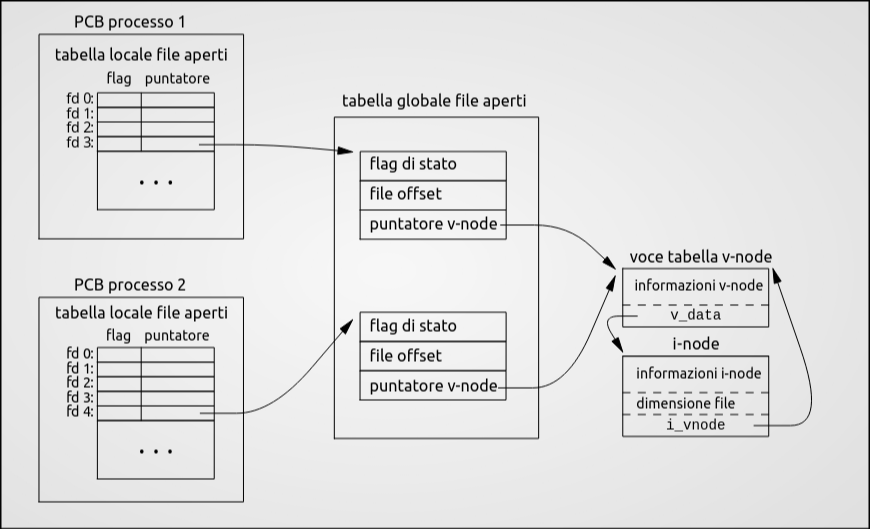

# Laboratorio
Nei moderni sistemi operativi possiamo fare due tipi di chiamate:<br>
- **chiamate di sistema**: offerte dal sistema operativo(**modalità kernel**)<br>
- **chiamate di libreria**: funzioni incluse in librerie di sistema(**modalità utente**) 

> [Libreria del professore](./Esempi/at_exit.c)

## Layout della memoria
 Quando un programma viene avviato, il sistema operativo gli assegna uno spazio di memoria suddiviso in segmenti specifici. Comprendere questa divisione è fondamentale per capire dove "vivono" le tue variabili.

Puoi vedere la dimensione di questi segmenti su un file compilato usando il comando da terminale `size nome_eseguibile`.
I Segmenti di Memoria:

- Text (Codice): Contiene le istruzioni del programma compilato in linguaggio macchina.

-  Data (Dati Inizializzati): Contiene le variabili globali (o statiche) a cui hai assegnato un valore nel codice (es. `int max = 100;`).

- BSS (Dati Non Inizializzati): Contiene le variabili globali (o statiche) dichiarate ma senza un valore iniziale (es. `int vector[50];`). Il sistema operativo le inizializza automaticamente a zero quando avvia il programma.

- Heap: Memoria dinamica, gestita manualmente dal programmatore (dove allochi spazio con `malloc` e lo liberi con `free`).

- Stack: Memoria automatica gestita dal sistema. Contiene le variabili locali dichiarate dentro le funzioni e gli argomenti passati alle funzioni stesse.

## Gestione degli errori

In C (su sistemi UNIX), le chiamate di sistema (system call) non "crashano" mostrando finestre di errore, ma segnalano il problema tramite i valori di ritorno.

- Quasi tutte le system call restituiscono -1 se c'è stato un errore.

- La variabile errno: Se una funzione restituisce -1, il sistema imposta automaticamente una variabile globale chiamata errno con un codice numerico che identifica il tipo di errore (es. EPERM per permesso negato, ENOENT se il file non esiste).

- Attenzione: In caso di successo, errno non viene resettata a zero. Devi controllarla solo dopo aver verificato che la funzione ha restituito -1.

### Funzioni per stampare l'errore:
<table border="1" style="border-collapse: collapse; text-align: left;">
  <thead>
    <tr>
      <th>Funzione</th>
      <th>Libreria</th>
      <th>Descrizione</th>
    </tr>
  </thead>
  <tbody>
    <tr>
      <td><code>perror(const char *s)</code></td>
      <td><code>&lt;stdio.h&gt;</code></td>
      <td>È la più comoda e usata. Stampa a schermo la tua <br>stringa <code>s</code>, seguita dai due punti e dalla descrizione <br> umana dell'errore (es. <code>perror("Errore apertura");</code><br> stampa <em>Errore apertura: No such file or directory</em>).</td>
    </tr>
    <tr>
      <td><code>strerror(int errnum)</code></td>
      <td><code>&lt;string.h&gt;</code></td>
      <td>Prende il numero dell'errore e restituisce solo la stringa <br>descrittiva (utile se vuoi formattare l'output manualmente <br>con una <code>printf</code>).</td>
    </tr>
  </tbody>
</table>

## Terminazione del processo

Un processo può terminare in vari modi (es. arrivando alla fine del main). Tuttavia, per forzare la chiusura o indicare al sistema operativo l'esito dell'esecuzione, si usa la funzione exit.

- Funzione: `void exit(int status)`; (Richiede `<stdlib.h>`)

- Exit Code (Codice di stato): È il numero che il tuo programma restituisce al sistema operativo alla chiusura.

    - `0` (o la costante `EXIT_SUCCESS`): Tutto è andato bene.

    - `>0` (o la costante `EXIT_FAILURE`): Il programma è terminato a causa di un errore.

-  Terminazione "Pulita": Quando chiami `exit()`, il sistema non "uccide" brutalmente il programma, ma prima scrive i buffer di memoria rimasti in sospeso e avvia eventuali procedure di chiusura che hai registrato tramite la funzione `atexit()`.<br>
[Esempio](./Esempi/at_exit.c)

## Descrittori dei File
In UNIX/Linux, tutto è considerato un file (hardware, terminali, file di testo, connessioni di rete). Per gestire questi "file", il sistema operativo usa i File Descriptors.

- Cos'è: È semplicemente un numero intero non negativo (0, 1, 2, 3...) che il sistema operativo ti "presta" come riferimento quando apri un file. Userai questo numero per tutte le operazioni successive (lettura, scrittura, chiusura).

- Canali Predefiniti: Appena avvii un programma, hai già 3 FD aperti di default (definiti in `<unistd.h>`):

<table border="1" style="border-collapse: collapse; text-align: left; width: 100%;">
  <thead>
    <tr>
      <th style="padding: 8px; text-align: center;">FD</th>
      <th style="padding: 8px;">Costante C</th>
      <th style="padding: 8px;">Significato</th>
      <th style="padding: 8px;">Destinazione tipica</th>
    </tr>
  </thead>
  <tbody>
    <tr>
      <td style="padding: 8px; text-align: center;"><code>0</code></td>
      <td style="padding: 8px;"><code>STDIN_FILENO</code></td>
      <td style="padding: 8px;">Standard Input</td>
      <td style="padding: 8px;">Tastiera</td>
    </tr>
    <tr>
      <td style="padding: 8px; text-align: center;"><code>1</code></td>
      <td style="padding: 8px;"><code>STDOUT_FILENO</code></td>
      <td style="padding: 8px;">Standard Output</td>
      <td style="padding: 8px;">Schermo (Terminale)</td>
    </tr>
    <tr>
      <td style="padding: 8px; text-align: center;"><code>2</code></td>
      <td style="padding: 8px;"><code>STDERR_FILENO</code></td>
      <td style="padding: 8px;">Standard Error</td>
      <td style="padding: 8px;">Schermo (Terminale, per gli errori)</td>
    </tr>
  </tbody>
</table>


## Apertura, creazione e chiusura (`open()`, `creat()` e `exit()`)
```C
#include <fcntl.h>
#include <unistd.h>
```

### La funzione `open()`


```C
int open(const char *path, int oflag, [mode_t mode]);
```

Apre un file con percorso `path` e restituisce il file descriptor, ovvero un intero non negativo che fa da indice in una voce della tabella dei file descriptor del processo chiamante. Una chiamata `open()` genera inoltre una nuova voce nella tabella dei file aperti a livello di sistema(system-wide open file table), all'interno della quale vengono registrati l'offset corrente del file e i flag di stato.
L'argomento `flag` deve contenere almeno una modalità di accesso tra:
- `O_RDONLY`: read only
- `O_WRONLY`: write only
- `O_RDWR`: read/write

In aggiunta possono essere cobminate 0 o più flags per l'apertura. <br>Consultare [man](https://man7.org/linux/man-pages/man2/open.2.html) per la lista completa dei flags.<br><br>
In caso di errore la funzione restituisce `-1` e aggiorna `errno` per indicare l'errore. 

### La funzione `creat()`

``` C
int creat(const char *path, mode_t mode ); 
```

Equivalente a `open()`. Infatti si comporta come se venisse chiamata nel seguente modo:
``` C 
 int creat(const char *path, mode_t mode)
  {
    return open(path, O_WRONLY|O_CREAT|O_TRUNC, mode);
  } 
```

- `O_WRONLY`: il file viene aperto in sola scrittura
- `O_CREAT`: il file viene creato se non esiste
- `O_TRUNC`: se il file esiste già, la sua lunghezza venga troncata a 0 (sovrascritto)

### La funzione `close()`

```C
int close(int fd);
```
Chiude un file descriptor. Restituisce `0` se ha successo e `-1` aggiornando `errno` in caso di errore.

## Permessi sugli oggetti del File-System UNIX
Nei metadati del file(all'interno dell'inode) il sistema riserva un intero per memorizzare varie informazioni. Gli ultimi 9 bit sono dedicati ai permessi. 
Un bit `1` signfica "permesso accordato" e un bit a `0` vuol dire "permesso negato".
Questi 9 bit sono suddivi in 3 blocchi da 3 bit ciascuno(`R`, `W`, `X`; read, write e execute):
- permessi utente proprietario(USR)
- permessi gruppo proprietario(GRP)
- permessi per gli altri utenti(OTH)

Quindi, un file con tutti i permessi avrà gli ultimi 9 bit dell'inode messi a `111 111 111` in binario o 0777 in rappresentazione ottale. 
Il comando per impostare i permessi è `chmod`. Es. `chmod 0777`.

Questa maschera si può ottenere da costanti definite in `sys/stat.h`
<table border="1" style="border-collapse: collapse; text-align: left; width: 100%;">
  <thead>
    <tr>
      <th style="padding: 8px;">Flag</th>
      <th style="padding: 8px;">Ottale</th>
      <th style="padding: 8px;">Permesso</th>
    </tr>
  </thead>
  <tbody>
    <tr>
      <td style="padding: 8px;">S_IRUSR</td>
      <td style="padding: 8px;">00400</td>
      <td style="padding: 8px;">owner has read permission</td>
    </tr>
    <tr>
      <td style="padding: 8px;">S_IWUSR</td>
      <td style="padding: 8px;">00200</td>
      <td style="padding: 8px;">owner has write permission</td>
    </tr>
    <tr>
      <td style="padding: 8px;">S_IXUSR</td>
      <td style="padding: 8px;">00100</td>
      <td style="padding: 8px;">owner has execute permission</td>
    </tr>
    <tr>
      <td style="padding: 8px;"></td>
      <td style="padding: 8px;"></td>
      <td style="padding: 8px;"></td>
    </tr>
    <tr>
      <td style="padding: 8px;">S_IRGRP</td>
      <td style="padding: 8px;">00040</td>
      <td style="padding: 8px;">group has read permission</td>
    </tr>
    <tr>
      <td style="padding: 8px;">S_IWGRP</td>
      <td style="padding: 8px;">00020</td>
      <td style="padding: 8px;">group has write permission</td>
    </tr>
    <tr>
      <td style="padding: 8px;">S_IXGRP</td>
      <td style="padding: 8px;">00010</td>
      <td style="padding: 8px;">group has execute permission</td>
    </tr>
    <tr>
      <td style="padding: 8px;"></td>
      <td style="padding: 8px;"></td>
      <td style="padding: 8px;"></td>
    </tr>
    <tr>
      <td style="padding: 8px;">S_IROTH</td>
      <td style="padding: 8px;">00004</td>
      <td style="padding: 8px;">others have read permission</td>
    </tr>
    <tr>
      <td style="padding: 8px;">S_IWOTH</td>
      <td style="padding: 8px;">00002</td>
      <td style="padding: 8px;">others have write permission</td>
    </tr>
    <tr>
      <td style="padding: 8px;">S_IXOTH</td>
      <td style="padding: 8px;">00001</td>
      <td style="padding: 8px;">others have execute permission</td>
    </tr>    
  </tbody>
</table>

Per le directory `X` rappresenta il diritto di attraversamento.

## Maschera di Creazione per i Permessi
Per ragioni di sicurezza quando un file(o una directory) viene creato la maschera(dei permessi) specificata viene combinata da una maschera di creazione che inibisce globalmente alcuni permessi.
La maschera dei permessi effettiva è data da: <br>
`effettiva = specificata & (~umask)`<br>

dove 

```c
mode_t umask(mode_t cmask);
```

L'espressione inibisce i permessi di `umask` messi a 1 lasciando gli altri intatti.

Se la directory padre in cui si sta creando il file ha una ACL di default(Access Control List), ovvero una maschera dei permessi, la `umask` del processo chiamante viene ignorata, il nuovo file eredita l'ACL del padre e i permessi effettivi vengono calcolati basandosi sull'ACL ereditata, incrociata con la maschera specificata dal chiamante.<br>
[Esempio Prof](./Esempi/creation-mask.c)<br>
[Mio Esempio](./Esempi/my_creation-mask.c)


## Posizionamento 
All'interno della System-Wide Open File Table vi è una voce che contiene la posizione attuale all'interno del file(offset), questo serve a simulare l'accesso sequenziale. Viene posto a `0` se durante la chiamata `open()` non si usa il flag `O_APPEND` e viene aggiornato dopo ogni operazione.

```C
off_t lseek(int fd, off_t offset, int whence);
```
Permette di spostare l'offset di un numero di bytes pari al parametro `offset` rispetto al punto `whence` che può assumere i seguenti valori:
- `SEEK_SET`: L'offset è posizionato a `offset` bytes
- `SEEK_CUR`: L'offset è posizionato alla posizione corrente più `offset` bytes
- `SEEK_END`: L' offset è posizionato alla dimensione del file(fine) più `offset` bytes<br>

Dalla versione del Kernel Linux 3.1 supporta anche le seguenti modalità:
- `SEEK_DATA`
- `SEEK_HOLE`<br>

`lseek()` permette di posizionare l'offset oltre la fine del file(questo però non ne cambierà la dimensione).Tuttavia, se si effettua una successiva operazione di `write()`, lo spazio tra la vecchia fine del file e il nuovo testo verrà riempito di byte nulli (`\0`), creando un  file hole. Questi buchi occupano spazio logico ma non consumano necessariamente blocchi fisici sul disco.

 La funzione`lseek()` ritorna `-1` in caso di errore o la nuova posizione all'intenro del file (`≥0`).
 Per ottenere la posizione attuale basta fare:
 ```C
 pos = lseek(fd, 0, SEEK_CUR);
 ```
 [Esempio Prof](./Esempi/test-seek-on-stdin.c)

 ## Lettura e Scrittura

 ### La funzione `read()`
 ```C
ssize_t read(int fd, void *buf, size_t nbytes);
 ```

Cerca di leggere fina a un numero `nbytes` di bytes, dal File Descriptor `fd`, mettendoli nel buffer  `buf`.

Nei File che supportano seeking la lettura inizia dall'offset indicato nella System-Wide Open File Table, e l'offset verrà spostato del numero di byte letti. Se l'offset è alla fine del file o oltre non verranno letti bytes e `read()` restituisce `0`. In caso di successo la funzione restituisce il numero di bytes letto e in caso di errore resituisce `-1` aggiornando `errno`, in questo caso non è specificato se la posizione all'interno file(se esiste) cambi.

> **Differenza tra size_t e ssize:t**
> * **`size_t`**: Intero **senza segno** (*unsigned*). Usato per i parametri di input (come `nbytes`) dove il valore deve essere sempre positivo.
> * **`ssize_t`**: Intero **con segno** (*signed*). Usato per il valore di ritorno perché deve poter restituire `-1` in caso di errore.


### La funzione `write()`
```C
ssize_t write(int fd, const void *buf, size_t nbytes);
```
Scrive fino a `nbytes` byte nel file descriptor `fd` leggendoli dal buffer `buf`.
Il numero di byte scritti può essere minore di quello indicato in `nbytes`se, per esempio, non c'è spazio sufficiente nel supporto fisico, o se incontra il limite di risorsa `RLIMIT_FSIZE`, o se la chiamata è stata interrotta da un segnale dopo aver scritto meno di `nbytes` byte.

Se il file supporta il seeking, la scrittura inizia dall'offset indicato nella System-Wide Open File Table, e l'offset verrà spostato del numero di byte scritti. Se il file è stato aperto con il flag `O_APPEND` l'offset verrà spostato alla fine del file prima di iniziare a scrivere. Il posizionamento dell'offset del file e l'operazione di scrittura verrano eseguite in modo atomico(inscindibile) dal kernel.


La funzione ritorna il numero di byte scritti. In caso di errore ritorna `-1` e aggiorna `errno`.

[Esempio Lettura Prof](./Esempi/count.c)<br>
[Esempio di scrittura con holes del Prof](./Esempi/hole.c)<br>
[Esempio del Prof con read e write](./Esempi/copy.c)

## Condivisione di Files e strutture dati di supporto



Quando si avvia un nuovo processo, il kernel alloca in memoria un nuovo PCB (Process Control Block), che contiene attributi fondamentali come il `PID` (Process ID), la umask e l'array dei File Descriptor (Per-Process File Descriptor Table).

All'avvio, le prime tre voci di questa tabella locale sono già occupate dai canali standard: `stdin` (0), `stdout` (1) e `stderr` (2).

Ogni voce (File Descriptor) all'interno di questa tabella contiene:

1. I flag locali del descrittore (es. close-on-exec).

2. Un puntatore a una voce della System-Wide Open File Table.

La System-Wide Open File Table è la tabella globale del kernel2. Ogni sua voce contiene:

- Metadati di stato: come l'offset corrente e i flag di stato (es. O_RDONLY).

- Reference Count: un contatore che indica quanti File Descriptor puntano attualmente a questa voce.

- Puntatore al v-node: un riferimento all'astrazione del file system.

Infine, il v-node contiene a sua volta il puntatore decisivo all'i-node, ovvero la struttura fisica sul disco con i dati reali del file.

> Il sistema di gestione dei file in UNIX non è altro che un colossale grafo di strutture dati in C collegate tra loro. Dal PCB del processo in memoria RAM, passando per le tabelle globali del kernel, fino ad arrivare all'i-node fisico sul disco rigido, l'intero sistema si regge su una complessa e precisissima rete di puntatori. È questa architettura a rendere il kernel così veloce.

## Istruzioni atomiche 

#### Problema 1: Accodamento concorrente (Scenario Multi-Processo)
Processi indipendenti che aprono lo stesso file ottengono voci separate nella System-Wide Open File Table e, dunque, file offset indipendenti.
- crittura (Race Condition): Un processo P1 vuole scrivere alla fine di un file di log e usa lseek per trovare la fine. Un attimo prima che possa scrivere, un processo P2 scrive la sua riga. Così facendo, l'offset calcolato da P1 diventa obsoleto e, scrivendo, P1 sovrascriverà i dati appena inseriti da P2.

#### Soluzione 1: flag `O_APPEND`
Se si apre il file con `O_APPEND`, il posizionamento dell'offset alla fine del file e la succcessiva operazione di scrittura verrano eseguite in modo atomico(inscindibile) dal kernel.
<br><br>

#### Problema 2: Accesso diretto concorrente (Scenario Multi-Thread)
Tutti i thread di uno stesso processo condividono la stessa voce nella System-Wide Open File Table e, dunque, condividono lo stesso file offset (il "segnalibro").

- Lettura/Scrittura (Race Condition): Se due thread devono leggere o scrivere in punti diversi del file usando la combinazione `lseek()` + `read()`/`write()`, si sposterebbero l'offset condiviso a vicenda tra un'istruzione e l'altra, leggendo o scrivendo dati errati.

#### Soluzione 2: `pread()` e `pwrite()`
Le istruzioni atomiche:
```C
ssize_t pread(int fd, void *buf, size_t nbytes, off_t offset); 
ssize_t pwrite(int fd, const void *buf, size_t nbytes, off_t offset);
```

Hanno lo stesso scopo di `read()` e `write()`, ma a differenza loro, `pread()` e `pwrite()`: 
- Eseguono il posizionamento dell'offset e la lettura/scrittura in modo atomico, evitando le race conditions.
- Non modificano il file offset condiviso globale (usano l'offset passato come parametro solo per quella singola operazione).

## Duplicazione dei descrittori dei file
### La funzione `dup()`
```C
int dup(int oldfd);
```
La funzione alloca un nuovo file descriptor (descrittore di file) che fa riferimento alla stessa descrizione del file aperto (nella System-Wide Open File Table) a cui punta oldfd.

- Il nuovo file descriptor sarà il più basso numero libero disponibile nella tabella dei file del processo chiamante (PCB).

- Il vecchio e il nuovo file descriptor possono essere usati in maniera intercambiabile: condividono il file offset e i flag di stato del file (es. O_APPEND, O_RDONLY).

- I due file descriptor avranno flag del file descriptor diverse (in particolare, il flag FD_CLOEXEC nel nuovo descrittore viene disattivato di default).
### La funzione `dup2()`
```C 
int dup2(int oldfd, int newfd);
```
`dup2()` esegue lo stesso compito di `dup()`, ma anziché usare il primo numero libero, impone al sistema di usare il numero esatto indicato nel parametro newfd.
- Se `newfd` era già aperto prima della chiamata a `dup2()`, quel file verrà chiuso prima di essere riutilizzato (la chiusura avviene in automatico e in modo silenzioso).

- Gli step di chiusura di `newfd` e la successiva duplicazione vengono eseguiti in maniera atomica. Questo evita race condition in scenari multi-thread.

Casi limite da esame su `dup2()`:

- Se `oldfd` non è valido la chiamata fallisce e `newfd` non viene chiuso.

- Se `oldfd` è uguale a `newfd` la funzione `dup2()` non fa assolutamente nulla (non chiude il file) e restituisce semplicemente `newfd`.

[Esempio del Prof](./Esempi/redirect.c)

## Cache del Disco
Per evitare che il sistema rallenti in attesa della scrittura fisica dei dati sul disco, viene impiegata una tecnica nota come "write-back cache", o cache a scrittura differita. Quando un programma salva un file, il Sistema Operativo non trasferisce immediatamente le informazioni sul supporto permanente, ma le scrive in una porzione di RAM libera chiamata "page cache", segnalando all'applicazione che l'operazione è già conclusa. Le porzioni di memoria così modificate, ma non ancora salvate fisicamente, prendono il nome di "dirty pages". L'effettivo trasferimento dei dati viene ritardato per ragioni di efficienza e gestito in background dal sistema, che periodicamente, in genere entro un limite massimo di trenta secondi, forza lo scaricamento di queste informazioni dalla RAM al supporto fisico. Sebbene questo approccio velocizzi notevolmente le operazioni, comporta dei rischi intrinseci dovuti alla natura volatile della RAM: in caso di interruzione improvvisa di corrente o di un crash di sistema prima che le scritture vengano completate, tutti i dati temporaneamente parcheggiati nella cache andranno irrimediabilmente persi, con il rischio aggiuntivo di corrompere le strutture logiche del disco se il blocco avviene esattamente durante la fase di trasferimento. Per arginare questi pericoli, le architetture moderne utilizzano file system dotati di Journaling (come NTFS o ext4), progettati per tenere un registro delle operazioni imminenti e facilitare il ripristino in caso di anomalie, mentre per le transazioni di dati assolutamente critiche esistono chiamate di sistema, che consentono di bypassare il ritardo di accodamento e imporre la scrittura immediata e sicura sul disco:

- `O_SYNC`: flag che può ossere usata durante una chiamata `open()`, gni singola operazione di `write() `effettuata su quel file diventa sincrona
- `fsync`: 
  ```C
  int fsync(int fd);
  ``` 
  trasferisce tutti i dati modificati del file descriptor `fd` nel disco.
- `sync`:
  ```C
  int fsync(int fd);
  ```
  forza tutte le informazioni in memoria che aggiornino i file systems a venire scritte sul disco.
  Esiste un comando omonimo per shell `sync`.


## I/O Buffering
Gli schemi per il buffering definiti nello standard del C sono:
- Unbuffered: i caratteri devono apparire dalla sorgente alla destinazione il prima possinibile, ne è esempio lo `stderr`
- Fully Buffered: i caratteri vengono trasmessi da e verso un file un blocco alla volta, quando il buffer è pieno.
- Line Buffered: i caratteri vengono trasmessi da e verso un file in blocco, ogni qualvolta viene incontrato un carattere new line(`\n`), ne sono esempio lo `stdin` e lo `stdout`

Lo standard ISO C fornisce una libreria per l'I/O bufferizzato basato su stream aggiungendo un tipo `FILE *` e degli stream predefiniti `stdin`, `stdout` e `stderr`

È sempre possibile forzare scritture pendenti nel buffer con `fflush`.

## Streams in C (`stdio.h`)

La libreria standard del C **`stdio.h`** introduce gli stream attraverso il tipo puntatore `FILE *`. 

Lo stream è una potente astrazione pensata per ridurre al minimo le costose chiamate al kernel (System Call) e il conseguente *Context Switch*. A differenza del File Descriptor (che è un semplice numero intero gestito dal kernel), uno stream è una struttura dati complessa (`struct FILE`) che risiede nello spazio di memoria del programma (*User Space*).

**Il Buffering:**
Gli stream creano una zona di memoria temporanea detta **buffer**. Le operazioni di lettura e scrittura avvengono prima su questo buffer per abbattere il numero di accessi reali al disco/dispositivo. Solo quando il buffer è pieno (o viene forzato lo svuotamento), lo stream effettua una singola System Call (es. `write` o `read`) per comunicare in blocco con il kernel.

### Funzioni Principali

- **`fopen`**: Apre un file interfacciandosi col kernel per il File Descriptor, alloca la memoria necessaria per la `struct FILE` (incluso il buffer) e restituisce lo stream.
- **`fdopen`**: Simile a `fopen`, ma crea e aggancia uno stream (e il relativo buffer) a un *File Descriptor* già aperto in precedenza a basso livello.
- **`fclose`**: Chiude lo stream. Prima di farlo, esegue un *flush* automatico (forza la scrittura sul disco di eventuali dati rimasti nel buffer temporaneo), per poi chiudere il File Descriptor associato.
- **`fgetc`**: Legge un singolo carattere dallo stream. Restituisce un `int` (non un `char`) per poter segnalare correttamente la macro `EOF` (End Of File, solitamente `-1`) in caso di termine o errore.
- **`fputc`**: Scrive un singolo carattere sullo stream.
- **`fgets`**: Legge una riga dallo stream (I/O testuale) e la salva come stringa in un buffer grande al massimo `n` byte. *Nota:* Salva anche il carattere di a capo `\n` letto e aggiunge automaticamente il terminatore di stringa `\0`.
- **`fputs`**: Scrive una stringa sullo stream.
- **`fread` e `fwrite`**: Gestiscono l'**I/O binario**. Rispettivamente, leggono e scrivono `nobj` record, ciascuno di dimensione `size` byte, da/verso lo stream. Sono perfette per leggere/scrivere blocchi di memoria esatti (come intere `struct`).
- **`fseek` e `fseeko`**: Spostano il *file offset* (la testina di lettura/scrittura) all'interno dello stream, basandosi su tre "ancore" di riferimento:
  - `SEEK_SET`: Spostamento a partire dall'inizio del file.
  - `SEEK_CUR`: Spostamento a partire dalla posizione corrente.
  - `SEEK_END`: Spostamento a partire dalla fine del file.

### Informazioni sugli oggetti del File-System
```C
#include <sys/stat.h>
#include <sys/types.h>

int stat(const char *restrict path, struct stat *restrict statbuf);
int fstat(int fd, struct stat *statbuf);
int lstat(const char *restrict path, struct stat *restrict statbuf);
```

Queste strutture ritornano informazioni rigurardanti il file nel buffer statbuf.

```C
#include <sys/stat.h>

struct stat {
  dev_t      st_dev;      /* ID of device containing file */
  ino_t      st_ino;      /* Inode number */
  mode_t     st_mode;     /* File type and mode */
  nlink_t    st_nlink;    /* Number of hard links */
  uid_t      st_uid;      /* User ID of owner */
  gid_t      st_gid;      /* Group ID of owner */
  dev_t      st_rdev;     /* Device ID (if special file) */
  off_t      st_size;     /* Total size, in bytes */
  blksize_t  st_blksize;  /* Block size for filesystem I/O */
  blkcnt_t   st_blocks;   /* Number of 512 B blocks allocated */

  /* Since POSIX.1-2008, this structure supports nanosecond
  precision for the following timestamp fields.
  For the details before POSIX.1-2008, see HISTORY.  */

  struct timespec  st_atim;  /* Time of last access */
  struct timespec  st_mtim;  /* Time of last modification */
  struct timespec  st_ctim;  /* Time of last status change */

  #define st_atime  st_atim.tv_sec  /* Backward compatibility */
  #define st_mtime  st_mtim.tv_sec
  #define st_ctime  st_ctim.tv_sec
};
```
[Esempio del Prof](./Esempi/stat.c)<br>

## Directory

```C
int mkdir (const char *path, mode_t mode); 
```
Crea una nuova directory con nome `path`, e maschera dei permessi `mode`(verrà sempre applicata **umask**).
In caso di errore ritornerà `-1`, altrimenti `0`.
```C
int rmdir(const char *path);
```

Cancella una directory con nome `path` la directory deve essere vuota. La funzione ritornerà `-1` in caso di errore, altrimenti `0`.

```C
int chdir(const char *path);
```
La directory il cui pathname è puntato da `path` diventa la nuova **current working directory** del processo chiamante. In caso di errore restituirà `-1` altrimenti `0`.

```C
char *getcwd(char *buf, size_t size);
```
Restituisce una null-terminated string contenente il percorso assoluto della **current working directory** del processo chiamante. Il percorso viene restituito come risultato della funzione e tramite l'argomento buf, se presente. In caso di errore la funzione ritorna `NULL`.

### Funzioni della libreria `dirent.h`
```C
DIR *opendir(const char *name); 
```
La funzione apre un **Directory stream** corrispondente alla directory `name` e ritorna un puntatore al directory stream.. Lo stream punta alla prima voce della directory.
```C
struct dirent *readdir(DIR *dirp);
```
La funzione `readdir()` legge la directory puntata da `dirp` e restituisce un puntatore a una struct dirent che descrive il prossimo elemento (file o sottocartella) in essa contenuto. Ritorna `NULL` se sono stati letti tutti gli elementi o se si verifica un errore.

La `struct dirent` è definita nel seguente modo:

```C
struct dirent {
  ino_t          d_ino;       /* Inode number */
  off_t          d_off;       /* Not an offset; see below */
  unsigned short d_reclen;    /* Length of this record */
  unsigned char  d_type;      /* Type of file; not supported by all filesystem types */
  char           d_name[256]; /* Null-terminated filename */        
};
```

```C
void rewinddir(DIR *dp); 
long telldir(DIR *dp); 
void seekdir(DIR *dp, long loc); 
int closedir(DIR *dp);
```
Servono in ordine per:
- sposta la posizione del directory stream `dp` all'inizio della directory
- ritorna la posizione assciata a `dp`
- imposta la posizione nel directory stream da cui inizierà la successiva chiamata a `readdir`. L'argomento `loc` deve essere un valore restituito da una precedente chiamata a `telldir`.
- chiude il directory stream `dp`